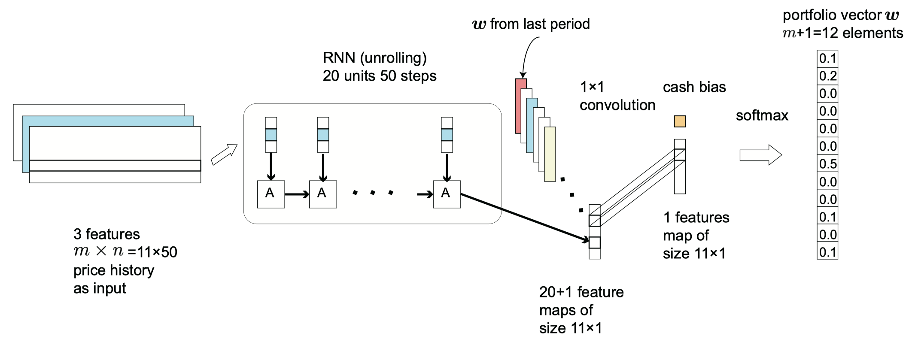

# 一个适用于金融资产组合管理问题的深度强化学习框架

作者：

Zhengyao Jiang zhengyao.jiang15@student.xjtlu.edu.cn

Dixing Xu dixing.xu15@student.xjtlu.edu.cn

Jinjun Liang jinjun.liang@xjtlu.edu.cn

本文发表于2017年7月16日

链接：https://arxiv.org/abs/1706.10059v2

GitHub：PGPortfolio: Policy Gradient Portfolio https://github.com/ZhengyaoJiang/PGPortfolio

## 摘要

金融资产组合管理是将一只基金持续分散投资到不同的金融产品的过程。本文贡献出一个无金融模型的强化学习框架，为金融资产组合提供一个深度机器学习的解决方案。本框架包括“同等独立评估器集成（EIIE）拓扑”、“资产组合向量存储器（PVM）”、“在线随机批量学习（OSBL）方案”以及“充分利用了的明确奖励函数”。本框架以三种方式进行了实现：卷积神经网络（CNN）、循环神经网络（RNN）、长短期记忆（LSTM）。对比于近期评阅的或发布了的投资组合选择策略，本文的策略在加密货币上进行间隔30分钟的三个回测试验。加密货币，相对于政府发行的货币，是电子的、去中心化的选择，其中比特币（Bitcoin）是最为熟知的例子。所有框架实现的三个实例，在所有实验上都占领了前三的位置，而且远远超出其他进行对比的交易算法。尽管回测中的佣金率（commission rate）为0.25％，但该框架能够在50天内至少获得4倍的回报。

## 关键词

机器学习；卷积神经网络；循环神经网络；长短期记忆；强化学习；深度学习；加密货币；比特币；算法交易；投资组合管理；量化金融

## 1. 简介

投资组合管理是一个决策问题，涉及到持续不断地将基金中的一部分资金分布到几种不同的投资品之中，期望获得最大收益的同时限制风险 ([^Haugen, 1986]; [^Markowitz, 1968])。传统投资组合和管理方法可以被归入四个类别：“跟随赢家”、“跟随输家”、“模式匹配”和“元学习” ([^Li and Hoi, 2014])。前两类基于预先构建的金融模型，而某些机器学习技术也可以辅助它们进行参数确定 ([^Li et al., 2012]; [^Cover, 1996])。这些方法的效果依赖于在不同市场上的模型有效性（validity）。模式匹配算法，预测的是下一个市场分布，基于一个历史数据的样本，以及基于市场分布采样数据的充分优化 ([^Gy¨orfi et al., 2006])。最后一个类别——“元学习”方法，结合了多种其他类别的策略来达到更稳定的评估表现 ([^Vovk and Watkins, 1998]; [^Das and Banerjee, 2011])。

现在的金融市场交易，有利用深度机器学习方法的。但是，他们中的大部分试图预测价格变动或者趋势([^Heaton et al., 2016]; [^Niaki and Hoseinzade, 2013]; [^Freitas et al., 2009])。将所有资产的历史价格作为输入，神经网络可以输出下一个时段的资产价格的预测向量。这样，交易智能体就可以基于这个预测进行操作。这个想法很容易实现，因为它是一个监督学习问题，或者更确切地说是一个回归问题。然而，这些价格预测算法的表现，高度依赖于预测的精度，但现实情况是未来的市场价格很难预测。更进一步，价格预测并不是市场操作行为，将他们转化为操作行为有需要更多的逻辑层。如果这个逻辑层是手工编码的，那么整个方法就不是一个全机器学习实现，因此不是非常具有扩展性和适应性。例如，一个基于预测的网络是很难将交易成本（transaction cost）考虑为一个风险因素的。

早先成功解决算法交易问题的无模型的和全机器学习方案，不去预测未来价格，而是将它视作一个强化学习（RL）问题。他们包括 Moody and Saffell (2001)[^Moody and Saffell (2001)]、Dempster and Leemans (2006)[^Dempster and Leemans (2006)]、Cumming (2015)[^Cumming (2015)], 以及最近 Deng et al. (2017)[^Deng et al. (2017)] 的强化学习应用。这些强化学习算法对于一个资产输出离散的交易信号。受限于单资产交易，他们对于通用的投资组合管理问题并不适用，毕竟在通用问题里，交易智能体管理着多种资产。

深度强化学习最近因为在电子游戏 ([^Mnih et al., 2015]) 和棋牌游戏 ([^Silver et al., 2016]) 里的卓越成绩，吸引了很多注意。这些就是强化学习问题，有着离散的行为空间，而且不能直接用到投资组合选择问题里，该问题里行为是连续的。尽管市场行为可以是离散化的，但离散化被视作一个主要的缺陷（drawback），因为离散的行为伴随着未知的风险。例如，一个极度离散的行为可以被定义为“投资所有的资本到一个资产里，而没有将风险分散到市场其余部分的投资品上”。加之，离散化导致扩展性差。市场因素，如总的投资品数，因市场的不同而不同。为了充分利用机器学习对不同市场的适应性优势，交易算法必须是可扩展的（scalable）。一个通用目的连续深度强化学习框架，也就是行动者-评论家（actor-critic）的确定策略梯度算法，最近被引介 ([^Silver et al., 2014]; [^Lillicrap et al., 2016])。这些 actor-critic 算法中的连续输出是通过神经网络近似的动作策略函数实现的，第二个网络被训练为奖励函数估计器。 然而，我们发现训练两个神经网络是困难的，有时甚至是不稳定的。

本文提出了一个专为资产组合管理任务而设计的强化学习框架。 该框架的核心是同等独立评估器集成（EIIE）拓扑。 IIE是一个神经网络，其作用是检查资产的历史并评估其在不久的将来的潜在增长。 每个资产的评估得分均会根据其在投资组合中资产的有意权重变化的大小进行折算，并传递给 softmax 层，其输出将是未来交易阶段的新投资组合权重。 投资组合的权重定义了强化学习交易智能体的市场行为。目标权重增加的资产将购买额外份额，权重减少的资产将被出售。除了市场历史，前一个交易期的投资组合权重也会输入到EIIE中。这是让RL智能体考虑交易成本对其财富的影响。为此，将每个时段的投资组合权重记录在投资组合向量存储器（PVM）中。 EIIE在在线随机批量学习方案（OSBL）中进行了训练，该方案与交易前预训练和在线交易期间的回测或在线交易都兼容。 RL框架的奖励函数是周期对数（logarithmic）收益的显式平均值。具有明确的奖励功能，EIIE在训练下沿着该功能的梯度上升方向进化。在这项工作中测试了三种不同类型的IIE，即卷积神经网络（CNN）([^Fukushima,1980]; [^Krizhevsky et al., ,2012]; [^Sermanet et al., 2012])，基本的递归神经网络（RNN）([^Werbos, 1988])。和长期短期记忆（LSTM）([^Hochreiter and Schmidhuber, 1997])。

作为一种全机器学习的方法，该框架不限于任何特定市场。 为了检验其有效性和可盈利性，该框架在加密货币（虚拟货币，比特币为最著名的例子）交易市场 Polonix.com 中进行了测试。 一组货币是根据实验前一段时间内的交易量排名预先选择的。 每30分钟一次的频率交易，进行了三个时间间隔良好分配的回测实验。 我们将这三个EIIE的表现与一些最近发布或审查过的投资组合选择策略进行了比较([^Li et al., 2015a]; [^Li and Hoi, 2014])。 在所有三个实验中，EIIE均显著击败了所有其他策略。

Cryptographic currencies，或简称加密货币，是政府发行的货币的电子的和分布式替代方案([^Nakamoto, 2008]; [^Grinberg, 2012])。虽然最著名的加密货币示例是比特币，但还有100多种其他可交易的加密货币相互竞争并与比特币竞争([^Bonneau et al., 2015])。这场竞赛的动机是比特币中存在许多设计缺陷，人们正在尝试发明新的数字货币以克服这些缺陷，希望他们的发明最终取代比特币([^Bentov et al., 2014]; [^Duffield and Hagan, 2014])。 但是，越来越多的加密货币在创建时并未以击败比特币为目标，而是旨在利用其背后的区块链技术来开发去中心化应用程序[^1]。到2017年6月，所有加密货币的总市值为1020亿美元，其中比特币占41％。 [^2]因此，尽管存在设计缺陷，比特币仍然是市场上占主导地位的加密货币。结果，许多其他货币不能用法定货币购买，而只能与比特币交易。

加密货币的两种性质使它们区别于传统的金融资产，使加密货币市场成为算法投资组合管理实验的最佳测试场。这些性质是去中心化和开放，而前者意味着后者。没有中心化的监管方，任何人都可以满足低门槛要求参与加密货币交易。一个直接的后果就是存在大量的小交易量货币。与传统市场相比，影响这些低价市场的价格将需要较少的投资。最终，这将使交易智能体学习并利用其自身的市场行为所带来的影响。开放也意味着市场更容易进入。大多数加密货币交易所，都具有用于获取市场数据和执行交易操作的应用程序编程接口（API），并且大多数交易所都是24/7全天候开放的，而且不会限制交易频率。这些不间断市场，非常适合机器在较短的时间内，在现实世界中学习。

本文的结构如下。 第2节，定义了该项目旨在解决的投资组合管理问题。 第3节，介绍了资产预选及其背后的原因，输入价格张量以及处理市场历史中缺失数据的方法。 在第4节中，用RL的语言重新描述了资产组合管理问题。第5节，介绍了EIIE元拓扑、PVM和OSBL方案。 这三个实验的结果，位于第6节。

## 2. 问题定义

资产组合管理是将资本不断重新分配到许多金融资产中的行为。 对于自动交易机器人，这些投资决策和操作是定期进行的。 本节提供了投资组合管理问题的数学设置。

### 2.1 交易期

在这项工作中，交易算法是时间驱动（time-driven）的，其中时间被划分为等长的时段 $T$ 。在每个时段的开始，交易智能体将资金重新分配到多种资产中去。 在本文的所有实验中，$T = 30分钟$。 资产的价格在一个时期内会涨跌，但四个重要的价格点，即开盘价、最高价、最低价和收盘价([^Rogers and Satchell, 1991])刻画了一个时期整体走势的特征。 对于连续市场，某一时期金融工具的开盘价为前一时期的收盘价。 在回测实验中，假设可以在每个时期开始时以该时期的开盘价购买或出售资产。 这种假设的理由在2.4节中给出。

### 2.2 数学形式主义

投资组合包括 $m$ 个资产。 所有资产的收盘价，均包含间隔 $t$ 的$价格向量 v_t$ 。 换句话说，$v_t$ 的第 $i$ 个元素—— $v_{i,t}$，是第 $t$ 时段的第 $i$ 个资产的收盘价。 同样，$v_t^{(hi)}$ 和 $v_t^{(lo)}$ 表示该时段的最高和最低价格向量。 投资组合中的第一种资产是特殊的，它就是报价的货币，在本文的其余部分称为 $现金$ 。 由于所有资产的价格均以现金报价，因此 $v_t$ 、 $v_t^{(hi)}$ 和 $v_t^{(lo)}$ 的首个元素始终为1，即 $v_{0,t}^{(hi)} = v_{0,t}^{(lo)}  = v_{0,t} = 1，∀ t$。 在本文的实验中，现金是比特币。

对于连续市场，$v_t$的元素是 $t+1$ 时刻的开盘价和 $t$ 时刻的收盘价。 第 $t$ 个交易时刻的 $价格相对向量 y_t$ 定义为 $v_t$ 元素方式除以$v_{t-1}$：
$$
\boldsymbol{y}_{t}:=\boldsymbol{v}_{t} \oslash \boldsymbol{v}_{t-1}=\left(1, \frac{v_{1, t}}{v_{1, t-1}}, \frac{v_{2, t}}{v_{2, t-1}}, \ldots, \frac{v_{m, t}}{v_{m, t-1}}\right)^{\top}\tag{1}
$$
符号：$:=$[^译者注1]

$y_t$ 的元素，是此时间段内，单个资产的收盘价和开盘价的商。 价格相对向量可用于计算一个时段内，投资组合总价值的变化。 如果 $p_{t-1}$ 是 $t$ 期开始时的投资组合价值，忽略交易成本，则：
$$
p_t=p_{t-1}\boldsymbol{y}_{t}\cdot \boldsymbol w_{t-1}, \tag{2}
$$
其中 $\boldsymbol w_{t-1}$ 是 $t$ 时段开始时的投资组合权重向量（从现在起称为$投资组合向量$），其第 $i$ 个元素—— $\boldsymbol w_{t-1,i}$  是资产 $i$ 在资本重新分配后在投资组合中的比例 。 元素 $\boldsymbol w_t$ 根据定义总是总和为1，$\sum_i \boldsymbol w_{t,i}=1,\forall t$。 那么时段 $t$ 的 $回报率$ 就是：
$$
\rho_{t}:=\frac{p_{t}}{p_{t-1}}-1=\boldsymbol{y}_{t} \cdot \boldsymbol{w}_{t-1}-1,\tag{3}
$$
与此同时，对应的 $对数回报率$ 就是：
$$
r_{t}:=\ln \frac{p_{t}}{p_{t-1}}=\ln \boldsymbol{y}_{t} \cdot \boldsymbol{w}_{t-1}\tag{4}
$$
在典型的投资组合管理问题中，初始投资组合权重向量 $\boldsymbol w_0$ 被选为欧几里得空间中的第一个基础向量：
$$
\boldsymbol w_0=(1,0,...,0)^\top, \tag{5}
$$
表示所有资金在进入市场之前，都在交易货币中。 如果没有交易成本，则最终投资组合价值为：
$$
p_{\mathrm{f}}=p_{0} \exp \left(\sum_{t=1}^{t_{\mathrm{f}}+1} r_{t}\right)=p_{0} \prod_{t=1}^{t_{\mathrm{f}}+1} \boldsymbol{y}_{t} \cdot \boldsymbol{w}_{t-1},\tag{6}
$$
其中 $p_0$ 是初始投资金额。 投资组合管理器的工作就是在给定的时间范围内最大化 $p_f$ 。

### 2.3 交易成本

在现实世界中，在市场上买卖资产不是免费的。 费用通常来自佣金。 假设佣金率是恒定的，本节将使用递归公式来重新计算公式（6）中的最终投资组合价值，该公式扩展了 Ormos 和Urb´an (2013)[^Ormos and Urb´an (2013)] 的工作。

时段 $t$ 开头的投资组合向量为 $w_{t-1}$。 由于市场价格的波动，在同一时期末，权重演变为：
$$
\boldsymbol{w}_{t}^{\prime}=\frac{\boldsymbol{y}_{t} \odot \boldsymbol{w}_{t-1}}{\boldsymbol{y}_{t} \cdot \boldsymbol{w}_{t-1}},\tag7
$$
这里 $\odot$ 是按元素乘法。 现在，在 $t$ 时段末，投资组合管理器的任务，是通过买卖相关资产重新分配投资组合向量，从 $\boldsymbol{w}_{t}^{\prime}$ 到 $\boldsymbol{w}_{t} $。 支付所有佣金后，此重新分配操作会将投资组合价值缩水 $\mu_t$ 倍。 $\mu_t\in（0,1]$，从现在开始将被称为 $交易余数因子$。$ \mu_t $ 将在下面确定。将 $p_{t-1}$ 表示为 $t$ 周期开始时的投资组合值，然后将 $p^{\prime}$ 表示为周期末的值：
$$
p_t=\mu_t p^{\prime}_{t\cdot} \tag8
$$
回报率（3）和对数回报率（4）现在是：
$$
\rho_{t}=\frac{p_{t}}{p_{t-1}}-1=\frac{\mu_{t} p_{t}^{\prime}}{p_{t-1}}-1=\mu_{t} \boldsymbol{y}_{t} \cdot \boldsymbol{w}_{t-1}-1 \tag{9}\\
$$

$$
r_{t}=\ln \frac{p_{t}}{p_{t-1}}=\ln \left(\mu_{t} \boldsymbol{y}_{t} \cdot \boldsymbol{w}_{t-1}\right) \tag{10}\\
$$

最后方程（6）投资组合的值变成了：
$$
p_{\mathrm{f}}=p_{0} \exp \left(\sum_{t=1}^{t_{\mathrm{f}}+1} r_{t}\right)=p_{0} \prod_{t=1}^{t_{\mathrm{f}}+1} \mu_{t} \boldsymbol{y}_{t} \cdot \boldsymbol{w}_{t-1}\tag{11}
$$
与未考虑交易成本的等式（4）和（2）不同，在等式（10）和（11）中，$p^{\prime}_t\not= p_t$，两个值之间的差异是交易余数因子起作用的地方。 图1展示了投资组合向量和值之间的关系以及它们在时间轴上的动态关系。

> 
>
> 图1：交易余数因子 $\mu_t$ 的影响图。由价格相对向量 $y_t$ 表示的 $t$ 时段内的市场变动，将投资组合的价值和投资组合的权重从 $p_{t-1}$ 和 $\boldsymbol{w}_{t-1}$ 推至 $p^{\prime}_t$ 和 $\boldsymbol{w}^{\prime}_{t}$。 在时间 $t$ 的资产买卖行为，将资金重新分配到 $\boldsymbol{w}_{t}$。作为附带影响，这些交易会将投资组合缩小到 $p_t$ 达 $\mu_{t}$ 倍。 使用公式（9）中两个连续周期开始时的投资组合值，来计算周期 $t$ 的回报率。

剩下的问题是确定交易剩余因子 $ \mu_t $。 在从 $\boldsymbol{w}_{t}^{\prime}$ 到 $\boldsymbol{w}_{t}$ 的投资组合重新分配期间，如果$p_{t}^{\prime} w_{t, i}^{\prime}>p_{t} w_{t, i} $ （或写为 $ w_{t, i}^{\prime}>\mu_{t} w_{t, i}$ ，代入（8）消去 $p_{t}^{\prime}$），则需要出售部分或全部资产 $i$。 所有出售获得的现金总额为：
$$
\left(1-c_{\mathrm{s}}\right) p_{t}^{\prime} \sum_{i=1}^{m}\left(w_{t, i}^{\prime}-\mu_{t} w_{t, i}\right)^{+} \tag{12}
$$
其中 $0 \leqslant c_{\mathrm{s}}<1$ 是出售的佣金率，$(v)^+ = ReLU(v)$ 是按元素线性整流函数，如果 $x> 0$，则 $(x)^+ = x$，否则，$(x)^+ = 0$ 。 这笔钱和原始现金储备 $p^{\prime}_tw^{\prime}_{t,0}$ 减去新储备 $\mu_tp^{\prime}_tw_{t,0}$ （也就是说不会把现金花完）将用于购买新资产。
$$
\left(1-c_{\mathrm{p}}\right)\left[w_{t, 0}^{\prime}+\left(1-c_{\mathrm{s}}\right) \sum_{i=1}^{m}\left(w_{t, i}^{\prime}-\mu_{t} w_{t, i}\right)^{+}-\mu_{t} w_{t, 0}\right]=\sum_{i=1}^{m}\left(\mu_{t} w_{t, i}-w_{t, i}^{\prime}\right)^{+}\tag{13}
$$
其中 $0 \leqslant c_{\mathrm{p}}<1$ 是购买的佣金率，而且在两边都把 $p^{\prime}_t$ 消掉了。 利用恒等式 $(a-b)^+-(b-a)^+=a-b$ 和 $w^{\prime}_{t,0}+\sum_{i=1}^{m}w^{\prime}_{t,i}=1=w_{t,0}+\sum_{i=1}^{m}w_{t,i}$ 方程（13）被化简成：
$$
\mu_{t}=\frac{1}{1-c_{\mathrm{p}} w_{t, 0}}\left[1-c_{\mathrm{p}} w_{t, 0}^{\prime}-\left(c_{\mathrm{s}}+c_{\mathrm{p}}-c_{\mathrm{s}} c_{\mathrm{p}}\right) \sum_{i=1}^{m}\left(w_{t, i}^{\prime}-\mu_{t} w_{t, i}\right)^{+}\right]\tag{14}
$$
在线性整流器中存在 $\mu_t$ 意味着 $ \mu_t$ 在无法找到解析解，但只能迭代求解。

**定理1** 表示
$$
f(\mu):=\frac{1}{1-c_{\mathrm{p}} w_{t, 0}}\left[1-c_{\mathrm{p}} w_{t, 0}^{\prime}-\left(c_{\mathrm{s}}+c_{\mathrm{p}}-c_{\mathrm{s}} c_{\mathrm{p}}\right) \sum_{i=1}^{m}\left(w_{t, i}^{\prime}-\mu w_{t, i}\right)^{+}\right]
$$
​				$序列 \left\{\tilde{\mu}_{t}^{(k)}\right\}定义为$
$$
\left\{\tilde{\mu}_{t}^{(k)} | \tilde{\mu}_{t}^{(0)}=\mu_{\odot} \text { and } \tilde{\mu}_{t}^{(k)}=f\left(\tilde{\mu}_{t}^{(k-1)}\right), k \in \mathbb{N}_{0}\right\}\tag{15}
$$
​				$对任何 \mu_{\odot} \in[0,1] ，收敛到 \mu_{t} 就是方程 (14)的解。$

尽管 Ormos和Urb´an(2013) [^Ormos and Urb´an (2013)]并未对此收敛进行说明，但其证明将在附录A中给出。该定理提供了一种以任意精度近似估算交易余数因子 $ \mu_t$ 的方法。 收敛速度取决于初始猜测 $\mu_{\odot}$ 的误差。  $|\mu_t-\mu_{\odot}|$ 越小，序列（15）收敛到 $ \mu_t$ 越快。 当 $c_p = c_s = c$ 时，有一种实践 ([^Moody et al., 1998]) 使用 $c\sum_{i=1}^m|w^{\prime}_{t,i}-w_{t,i}|$ 近似 $\mu_t$。因此，这我的工作中，$\mu_{\odot}$ 会使用它作为序列的第一个值，即：
$$
\mu_{\odot}=c\sum_{i=1}^m|w^{\prime}_{t,i}-w_{t,i}|\tag{16}
$$
在神经网络的训练中，带有一个固定的 $k$ 的 $\tilde{\mu}_{t}^{(k)}$ 被使用到了。在回测试验中，容忍误差 $\delta$ 动态决定着 $k$ ，也就是第一个 $k$ ，以至于使用 $\left|\tilde{\mu}_{t}^{(k)}-\tilde{\mu}_{t}^{(k-1)}\right|<\delta$ ，让 $\tilde{\mu}_{t}^{(k)}$ 近似于 $ \mu_t $。总的来说，$\mu_t$ 和它的近似值，是最近两个时段的投资组合向量与价格相对向量的函数：
$$
\mu_{t}=\mu_{t}\left(\boldsymbol{w}_{t-1}, \boldsymbol{w}_{t}, \boldsymbol{y}_{t}\right)\tag{17}
$$
在整个工作过程中，所有非现金资产的买卖均使用单一的固定佣金率，$c_s = c_p = 0.25％$，即 Poloniex 的最高利率。

算法智能体的目的是为了生成投资组合向量时间序列，$\left\{\boldsymbol{w}_{1}, \boldsymbol{w}_{2}, \cdots, \boldsymbol{w}_{t}, \cdots\right\}$，以便在考虑交易成本的情况下，最大化（11）中的累积资本 。

### 2.4 两个假设

在这项工作中，仅考虑回测交易，在这种情况下，交易智能体假装在市场历史上的某个时间点及时返回，不知道任何“未来”市场的信息，并从那时开始进行纸面交易。 作为回测实验的要求，施加以下两个假设：

1. 零滑点：所有市场资产的流动性足够高，下订单时可以立即以最后价格进行每笔交易。

2. 零市场影响：交易智能体软件投入的资金微不足道，对市场没有影响。

在现实世界的交易环境中，如果市场中的交易量足够高，则这两个假设接近现实。

## 3. 数据处理

交易实验是在 Poloniex 交易所中进行的，该交易所有约80种可交易的加密货币资产对，和约65种可用的加密货币[^3]。 但是，由于以下原因，交易机器人在一个时期内仅考虑一小部分货币。 除了货币选择方案之外，本节还介绍了作为神经网络输入的数据结构、规范化预处理以及处理丢失数据的方案。

### 3.1 资产预选

在本文的实验中，预先选择了11种最大交易量的非现金资产作为投资组合候选。连同现金比特币一起，投资组合的大小 $m + 1$ 为 12。该数字是根据经验选择的，可以在以后的实验中进行调整。对于诸如外汇市场之类的交易量较大的市场，$m$ 可以等于可用资产总数。

选择最主要的加密货币（以下简称为货币）的原因之一是，交易量越大，意味着资产的市场流动性越好。反过来，这意味着市场状况更接近于2.4节中设定的假设1。较高的交易量也表明投资对市场的影响较小，可以建立更接近假设2的环境。考虑到与某些日常交易算法相比较高的交易频率（30分钟），在当前环境下，流动性和市场规模尤为重要。此外，加密货币市场不稳定。一些以前很少交易或流行的货币可能会在短时间内突然增加或减少交易量。因此，相对于交易期间，资产预选的数量具有更长的时间范围。在这些实验中，使用30天的时间。

但是，在回测实验中，使用最大交易量进行货币选择，会导致$幸存者偏差$。资产的交易量与其受欢迎程度相关，而受欢迎程度又取决于其历史表现。将未来的交易量排名进行回测，将不可避免地和间接地将未来的价格信息传递给实验，从而导致不可靠的正向结果。由于这个原因，在回测开始之前，用于预选时就将成交量信息去掉了，以避免生存偏差。

### 3.2 价格张量

历史价格数据被馈入神经网络以生成投资组合向量输出。本小节描述输入张量的结构、其归一化方案以及如何处理丢失的数据。

在周期 $t$ 的末尾，神经网络的输入是张量 $\boldsymbol{X}_{t}$，其阶数为3，形状为 $(f，n，m)$，其中 $m$ 是预选的非现金资产的数量，$n$ 是时刻 $t$ 之前的输入时段数量，$f = 3$ 是特征数量。由于历史上较早的价格与当前价格的相关性，比与最近的价格相比低得多，因此实验的 $n = 50$（一天零一个小时）。选择 $m$ 资产的标准在第3.1节中给出。时段 $t$ 上资产 $i$ 的特征是其区间中的收盘价、最高价和最低价。使用第2.2节中的符号，它们是$v_{i,t}、v_{i,t}^{(hi)}和 v_{i,t}^{(lo)}$ [^译者注2]。但是，这些绝对价格值不会直接馈送到网络。因为只有价格的变化才决定投资组合管理的表现（等式（10）），所以输入张量中的所有价格都将根据最新的收盘价进行归一化。因此，$\boldsymbol{X}_{t}$是三个归一化价格矩阵的叠加，

这里$\boldsymbol{V}_{t}、\boldsymbol{V}_{t}^{(\mathrm{hi})}$ 和 $\boldsymbol{V}_{t}^{(\mathrm{lo})}$ 就是归一化后的价格矩阵，
$$
\begin{aligned}
\boldsymbol{V}_{t} &=\left[\boldsymbol{v}_{t-n+1} \oslash \boldsymbol{v}_{t}\left|\boldsymbol{v}_{t-n+2} \oslash \boldsymbol{v}_{t}\right| \cdots\left|\boldsymbol{v}_{t-1} \oslash \boldsymbol{v}_{t}\right| \mathbf{1}\right] \\
\boldsymbol{V}_{t}^{(\mathrm{hi})} &=\left[\boldsymbol{v}_{t-n+1}^{(\mathrm{hi})} \oslash \boldsymbol{v}_{t}\left|\boldsymbol{v}_{t-n+2}^{(\mathrm{hi})} \oslash \boldsymbol{v}_{t}\right| \cdots\left|\boldsymbol{v}_{t-1}^{(\mathrm{hi})} \oslash \boldsymbol{v}_{t}\right| \boldsymbol{v}_{t}^{(\mathrm{hi})} \oslash \boldsymbol{v}_{t}\right] \\
\boldsymbol{V}_{t}^{(\mathrm{lo})} &=\left[\boldsymbol{v}_{t-n+1}^{(\mathrm{lo})} \oslash \boldsymbol{v}_{t}\left|\boldsymbol{v}_{t-n+2}^{(\mathrm{lo})} \oslash \boldsymbol{v}_{t}\right| \cdots\left|\boldsymbol{v}_{t-1}^{(\mathrm{lo})} \oslash \boldsymbol{v}_{t}\right| \boldsymbol{v}_{t}^{(\mathrm{lo})} \oslash \boldsymbol{v}_{t}\right]
\end{aligned}
$$
上面的 $\mathbf{1}=(1,1, \cdots, 1)^{\top}$ 以及 $\oslash$ 就是按元素初操作子。

在时段 $t$ 的末尾，根据某些策略 $\pi$，投资组合管理器仅使用来自价格张量 $\boldsymbol{X}_{t}$ 和先前投资组合矢量 $\boldsymbol{w}_{t-1}$ 的信息得出投资组合矢量 $\boldsymbol{w}_{t} $。 换句话说，$\boldsymbol{w}_{t}=\pi\left(\boldsymbol{X}_{t}, \boldsymbol{w}_{t-1}\right)$。 在时段 $t +1$ 的末尾，可以使用公式（10）使用价格变化矢量 $y_{t + 1}$ 的附加信息，基于决策 $\boldsymbol{w}_{t}$ 计算该时段的对数收益率，其中 $r_{t+1}=\ln \left(\mu_{t+1} \boldsymbol{y}_{t+1} \cdot \boldsymbol{w}_{t}\right)$ 。 用RL的语言来说，$r_{t+1}$是投资组合管理智能体在环境条件 $\boldsymbol{X}_{t}$ 下的行动 $\boldsymbol{w}_{t} $的直接奖励。

### 3.3 填充缺失数据

某些选定的货币缺少部分历史记录。缺少数据，是由于这些货币是相对较新出现的。货币存在之前的数据点，在交易所中标记为非数字（NANs）。 NANs 仅出现在训练集中，因为货币选择标准是回测前30天的数量排名，这意味着所有资产必须在此之前存在。

由于神经网络的输入必须是实数，因此必须替换这些NAN。在作者先前的工作([^Jiang and Liang, 2017])中，缺失数据填充了伪造的递减价格序列，衰减率为0.01，以使神经网络避免在训练过程中选择持有这些缺失的资产。但是，事实证明，这些网络深深地记住了这些特殊资产，即使在反向测试实验中它们处于非常有希望的上升趋势时，模型也避免持有它们。因此，在当前的工作中，使用虚假的价格变动（衰减率为0）来填充缺失的数据点。此外，在新的EIIE结构下，单个资产的身份将对新的网络不可见，从而使他们无法根据长期以来特定资产的不良记录做出决策。

## 4. 强化学习

考虑到第2节中定义的问题，本节介绍了使用确定策略梯度算法的强化学习解决方案框架。在该框架下还给出了显式的奖励函数。

### 4.1 环境与智能体

在算法投资组合管理问题中，智能体是在金融市场环境中执行交易操作的软件投资组合管理器。这种环境包括市场中所有可用资产，以及所有市场参与者对它们的期望。

智能体不可能获得如此大而复杂的环境的全部状态信息。但是，在技术交易者的哲学中([^Charles et al., 2006]; [^Lo et al., 2000])，所有相关信息都被认为已经反映在资产价格中了，而资产价格向智能体公开。按照这种观点，环境状态可以用整个市场历史直到状态发生时的所有订单的价格来大致表示。尽管对于许多金融市场来说，完整的订单历史记录都是开放在公共领域，但是对于软件智能体而言，要实际处理此信息实在是一项艰巨的任务。结果，订单历史信息的子采样方案，被用于将来，简化了市场环境的状态表示。这些方案包括第3.1节中所述的资产预选、周期性特征提取和历史记录截断。定期特征提取，将时间离散化为多个时段，然后提取每个时段中的最高价、最低价和收盘价。历史记录截断仅采用最近一段时间的价格特征来表示环境的当前状态。结果表示为第3.2节中描述的价格张量 $\boldsymbol{X}_{t}$ 。

根据第2.4节中的假设2，智能体的交易行为不会影响市场的未来价格状态。但是，在 $t$ 时刻开始时采取的动作将影响 $t +1$ 时刻的奖励，结果将影响其采取的动作。为了在资产 $t + 1$ 期间重新分配财富，智能体在 $t + 1$ 期初进行的买卖交易由投资组合权重 $\boldsymbol{w}^{ \prime }_{t}$ 和 $\boldsymbol{w}_{t}$ 之间的差异决定。  $\boldsymbol{w}^{ \prime }_{t}$ 在方程（7）中用 $\boldsymbol{w}_{t-1}$ 定义，它在最后一个周期的作用中也起作用。由于在最后一个周期中已经确定了 $\boldsymbol{w}_{t-1}$ ，因此智能体在时间 $t$ 的动作，只能由投资组合向量$\boldsymbol{w}_{t}$ 表示，
$$
\boldsymbol{a}_{t}=\boldsymbol{w}_{t\cdot}\tag{19}
$$
因此，通过 $r_{t + 1}$ 和 $\mu_{t + 1}$ 对 $\boldsymbol{w}_{t}$ 的依赖性（17），先前的动作确实对当前动作的决定有影响。 在当前框架中，通过将 $\boldsymbol{w}_{t-1}$ 视为环境的一部分并将其输入到智能体的行为制定策略中，来封装这种影响，因此 $t$ 处的状态表示为 $\boldsymbol{X}_{t}$ 和 $\boldsymbol{w}_{t-1}$ 对，
$$
\boldsymbol{s}_{t} = (\boldsymbol{X}_{t},\boldsymbol{w}_{t-1}),\tag{20}
$$
其中 $\boldsymbol{w}_{0}$ 在（5）中是预先确定的。 状态 $\boldsymbol{s}_{t}$ 由两部分组成，由价格张量 $\boldsymbol{X}_{t}$ 表示的外部状态，以及从上一周期 $\boldsymbol{w}_{t-1}$ 开始的由投资组合矢量表示的内部状态。 因为根据第2.4节的假设2，投资组合金额与市场的总交易量相比可以忽略不计，所以内部状态中不包含 $p_t$。

### 4.2 充分的利用和奖励功能

在 $t_f + 1$ 周期结束时，智能体的工作就是使等式（11）的最终投资组合价值 $p_f $ 最大化。 由于智能体无法控制初始投资 $p_0$ 的选择以及整个投资组合管理过程 $t_f$ 的时间，因此该工作等同于最大化平均对数累积回报 $R$，
$$
\begin{aligned}
R\left(\boldsymbol{s}_{1}, \boldsymbol{a}_{1}, \cdots, \boldsymbol{s}_{t_{\mathrm{f}}}, \boldsymbol{a}_{t_{\mathrm{f}}}, \boldsymbol{s}_{t_{\mathrm{f}}+1}\right) &:=\frac{1}{t_{\mathrm{f}}} \ln \frac{p_{\mathrm{f}}}{p_{0}}=\frac{1}{t_{\mathrm{f}}} \sum_{t=1}^{t_{\mathrm{f}}+1} \ln \left(\mu_{t} \boldsymbol{y}_{t} \cdot \boldsymbol{w}_{t-1}\right) \\

&=\frac{1}{t_{\mathrm{f}}} \sum_{t=1}^{t_{\mathrm{f}}+1} r_{t}
\end{aligned} \tag{21, 22}
$$

在（21）的右侧， $\boldsymbol{w}_{t-1}$ 由行动 $\boldsymbol{a}_{t-1}$ 给定，$\boldsymbol{y}_t $ 是来自状态变量 $\boldsymbol{s}_t$ 的价格张量 $\boldsymbol{X}_{t}$ 的一部分，如公式（17）中所述，$\mu_t $ 是 $\boldsymbol{w}_{t-1}$ 、 $\boldsymbol{w}_{t}$ 和 $\boldsymbol{y}_t $ 的函数。用RL语言表示，$R$ 是累积奖励，而 $r_t / t_f$ 是单个时段episode的直接奖励。分母 $t_f $ 与使用累积投资组合价值的奖励函数不同([^Moody et al., 1998])，它保证了不同运行长度之间奖励函数的公平性，使其能够以小批量方式训练交易策略。

通过这种奖励功能，当前框架与许多其他RL问题有两个重要区别。一是 episode 奖励和累积性奖励都可以准确表达。换句话说，环境的领域知识是被我们完全掌握的，并且可以被智能体充分利用的。这种确切的表达方式基于第2.4节的假设1，即动作对未来状态的外部部分（价格张量）没有影响。行动与外部环境的这种隔离也使人们可以使用同一市场历史片段来评估不同的行动序列。框架的此功能被认为是一个主要优势，因为在交易游戏中，进行全新的试验既费时又费力。

第二个区别是，所有 episode 奖励对于最终回报都是同等重要的。这种区别与“无市场影响”假设一起，允许将 $r_t / t_f $视为行为 $\boldsymbol{w}_{t}$ 的行为价值函数，其贴现因子为0，而无需考虑该行为的未来影响。拥有明确的行动价值函数进一步证明了充分利用方法的合理性，因为探索其他RL问题主要是为了尝试各种类别的行动价值函数。

另一方面，如果不进行探索，则可以通过随机初始化策略参数来避免局部最优，这将在下面进行讨论。

### 4.3 确定性策略梯度

策略是从状态空间到动作空间的映射，$\pi: \mathcal{S} \rightarrow \mathcal{A}$。在当前框架中进行了充分利用后，策略将确定地从状态中产生动作。最佳策略是使用梯度上升算法获得的。为了实现这一点，我们通过一组参数 $\boldsymbol{\theta}$ 和 $\boldsymbol{a}_{t}=\pi_{\boldsymbol{\theta}}\left(\boldsymbol{s}_{t}\right)$ 来精确确定一个策略。将时间间隔$[0，t_f]$的 $\pi_{\boldsymbol{\theta}}$ 的性能指标，定义为时间间隔的相应奖励函数（21），
$$
J_{\left[0, t_{\mathrm{f}}\right]}\left(\pi_{\boldsymbol{\theta}}\right)=R\left(\boldsymbol{s}_{1}, \pi_{\boldsymbol{\theta}}\left(s_{1}\right), \cdots, \boldsymbol{s}_{t_{\mathrm{f}}}, \pi_{\boldsymbol{\theta}}\left(s_{t_{\mathrm{f}}}\right), \boldsymbol{s}_{t_{\mathrm{f}}+1}\right)\tag{23}
$$
随机初始化后，参数会沿梯度方向以学习率 $\lambda$ 连续更新，
$$
\boldsymbol{\theta} \longrightarrow \boldsymbol{\theta}+\lambda \nabla_{\boldsymbol{\theta}} J_{\left[0, t_{\mathrm{f}}\right]}\left(\pi_{\boldsymbol{\theta}}\right)\tag{24}
$$
为了提高训练效率并避免计算机精度错误，将在小型批次而不是完整市场历史记录训练数据上更新 $\boldsymbol{\theta}$。 如果小批量的时间范围是$[t_{b_1}，t_{b_2}]$，则该批的更新规则为：
$$
\boldsymbol{\theta} \longrightarrow \boldsymbol{\theta}+\lambda \nabla_{\boldsymbol{\theta}} J_{\left[t_{\mathrm{b}_{1}}, t_{\mathrm{b}_{2}}\right]}\left(\pi_{\boldsymbol{\theta}}\right)\tag{25}
$$
与（21）中定义的R相应的分母由 $t_{b_2}-t_{b_1}$ 代替。这种梯度上升的小批量方法还允许在线学习，这对于在线交易中非常重要，因为新的市场历史数据不断输入智能体。在线学习和小批量培训的详细信息将在5.3节中讨论。

## 5. 策略网络

策略函数 $\pi_{\boldsymbol{\theta}}$ 将使用三个不同的深度神经网络构造。本文的神经网络与以前的版本([^Jiang and Liang, 2017])有所不同，具有三个重要的创新：针对投资组合管理问题而发明的微型机器拓扑结构、投资组合向量和存储器随机的小批量在线学习方案。

### 5.1 网络拓扑

建立策略功能的神经网络的三个具体典型是CNN，基本RNN和LSTM。图2显示了为解决当前项目组合管理问题而设计的CNN的拓扑结构，而图3描绘了针对同一问题的基本RNN或LSTM网络的结构。在所有情况下，网络的输入是在（18）中定义的价格张量 $\boldsymbol{X}_{t}$ ，而输出是投资组合矢量 $\boldsymbol{w}_{t}$ 。在这两个图中，均使用了投资组合矢量输出的假设示例，而价格张量的维度以及资产数量是实验中部署的实际值。最后一个隐藏层是所有非现金资产的投票分数。这些分数的 softmax 结果和现金偏差成为实际的相应投资组合权重。为了使神经网络考虑交易成本，将来自最后一个周期的投资组合矢量 $\boldsymbol{w}_{t-1 }$ 插入到投票层之前的网络中。在第5.2节中介绍了，以并行方式存储和检索投资组合向量的实际机制。

> 
>
> 图2：EIIE 的 CNN 实现：这是同等独立评估器（EIIE）集成的实现，完全卷积网络。 所有特征图中所有局部感受野的第一维为1，使所有行彼此隔离，直到 softmax 激活为止。 除了特征图中感受野之间的权重共享（CNN的一般特征）外，EIIE配置中的行之间也共享参数。 整个网络的每一行都分配有特定资产，并负责把未来的交易期中具备资产增长潜力的资产，向 softmax 提交投票分数。网络的输入是一个 $3×m×n$ 的价格张量，包括过去 $n$ 个时期内 $m$ 种非现金资产的最高、最高和最低价格。 输出是新的投资组合权重。 先前的投资组合权重作为额外的特征图，插入到评分层之前，以使智能体将交易成本降至最低。
>
> 
>
> 图3：EIIE的RNN（基本RNN或LSTM）实现：这是同等独立评估器（EIIE）集成的循环实现。 在此版本中，单个资产的价格输入由小型循环子网获取。 这些子网是相同的LSTM或基本RNN。 循环子网之后的集成网络结构与图2中CNN的后半部分相同。

这三个网络中一个至关重要的共同特征是，网络对 $m$ 个资产来说是独立流动，而网络参数在这些流之间共享。这些流就像独立的但规模较小的相同网络一样，分别观察和评估单个非现金资产。它们仅在 softmax 功能处互连，只是要确保其输出权重为非负值且总和为1。我们称这些“流”为“微型机器”或更正式地称为同等独立评估器（IIE），并且这种拓扑特征——IIE的集合体（EIIE）可以被称为“微型机器”方法，以便在早期尝试中与有益的方法区分开([^Jiang and Liang, 2017]) 。 EIIE在图2和3中分别进行了不同的实现。图2中的IIE只是具有核高度为1的卷积链，而在图3中，它是以单个资产的价格历史为输入的 LSTM 或 基本 RNN。

EIIE大大提高了投资组合管理的表现。因为以前版本中的集成网络记住单个资产的历史表现，更不愿意将资金投资到历史上表现不利的资产上，即使该资产的前景更加光明。另一方面，IIE被设计为所分配资产的身份不可见，而仅根据最近发生的事件，就能够判断其潜在的上涨与下跌。

从实际的角度来看，EIIE比集成网络，还具有其他三个关键优势。首先是资产数量的可扩展性。具有共享参数的“微型机器”都彼此同等，因此在集成尺度上的训练时间大致与 $m$ 成线性关系。第二个优势是数据使用效率。对于一时段的价格历史记录，一台微型机器可以在不同资产上进行 $m$ 次训练。然后在时间和资产维度上，共享和积累IIE的资产评估经验。最后一个优势是资产收集的可塑性。由于IIE的资产评估能力是通用的，而不受限于任何特定资产，因此EIIE可以实时更新其资产选择和/或投资组合的大小，而不必从零开始重新训练网络。

### 5.2 投资组合向量存储器

为了使投资组合管理智能体将交易成本降至最低，通过限制其自身在连续的投资组合向量之间发生较大的变化，先前交易期间的投资组合权重的输出，是作为输入进入网络的。实现此目的的一种方法是依赖RNN的记忆能力，但是采用这种方法，必须放弃（18）中提出的价格标准化方案。根据经验，此归一化方案的性能要优于其他归一化方案。另一种可能的解决方案是 Moody and Saffell (2001)[^Moody and Saffell (2001)] 提出的直接强化（Direct Reinforcement, RR）。但是，RR 和 RNN 记忆受困于梯度消失问题。更重要的是，RR 和 RNN 需要对训练过程进行序列化，无法在小批量中利用并行训练。

> 
>
> 图4：投资组合向量存储器的读/写周期：在两个图中，时间轴上的垂直小条，表示一个时段开始时包含投资组合权重的一部分记忆。 红色记忆将被读取到策略网络，而蓝色记忆将被网络覆盖。 (a)中由四个条带组成的两个彩色矩形是两个连续迷你批的示例。 (a)展示了一个小批量的完整读写圈，(b)展示了一个网络内的循环（省略了网络的CNN或RNN部分）。

在本文的工作中，受经验重现记忆（experience replay memory）([^Mnih et al., 2016])想法的启发，引入了专用的投资组合向量记忆存储器（Portfolio-Vector Memory, PVM）来存储网络输出。如图4所示，PVM 是按时间顺序排列的投资组合的向量堆叠。在进行任何网络训练前，将使用统一的权重初始化 PVM。在每个训练步中，策略网络从 $t-1$ 处的记忆位置加载上一期间的投资组合矢量，并用其输出覆盖 $t$ 处的记忆。随着策略网络的参数通过许多训练 epoch 收敛，存储器中的值也收敛。

共享单个记忆堆栈可使网络针对小型批次内的数据点同时进行训练，从而极大地提高了培训效率。对于RNN版本的网络，在循环块之后插入最后的输出（图3）可以避免将梯度传递回到深度RNN结构中去，从而避免了梯度消失的问题。

### 5.3 在线随机批处理学习

随着网络输出存储器的引入，尽管学习框架要求顺序输入，但小批量训练变得可行。但是，与监督学习不同，在监督学习中，数据点是无序的，小批量数据集是训练样本空间中随机不相交的子集，而在本文这种训练方案中，一批数据中的数据点必须按其时间顺序排列。另外，由于数据集是时间序列，因此以不同时段开始的小批量被认为是有效且与众不同的，即使它们具有明显重叠的间隔。例如，如果统一批次大小为 $n_b$，则覆盖 $[t_b，t_b + n_b)$ 和 $[t_b + 1，t_b + n_b +1)$ 的数据集是两个不同的有效批次。

金融市场不断变化的性质意味着新数据会不断涌入智能体，因此，训练样本的规模会无限爆炸。所幸，人们相信，两个市场价格事件的相关性与它们之间的时间距离成指数关系衰减([^Holt, 2004]; [^Charles et al., 2006])。出于这种信念，这里提出了一种在线批量学习（OSBL）方案。

在第 $t$ 时段末，此期的价格变动将添加到训练集中。在 $t + 1$ 时段，智能体完成其订单后，将针对该集合中随机选择的 $N_b$ 个小批数据集，对策略网络进行训练。我们以几何分布概率 $P_{\beta}\left(t_{\mathrm{b}}\right)$ 选取，以时段 $t_{\mathrm{b}} \leqslant t-n_{\mathrm{b}}$ 开始的批次，
$$
P_{\beta}\left(t_{\mathrm{b}}\right)=\beta(1-\beta)^{t-t_{\mathrm{b}}-n_{\mathrm{b}}}\tag{26}
$$
其中 $\beta \in(0,1)$ 是概率衰减率，确定着概率分布的形状，以及最近的市场事件有多重要，$n_b $ 是小批次中的时段数。

## 6. 实验

到目前为止，已经开发完成了该工具，并在加密货币交易所Poloniex，使用所有三个策略网络，进行了不同时间框架的三个回测实验。将结果与许多公认的和最近发布的投资组合选择策略进行比较。比较的主要金融指标是投资组合价值、最大跌幅和夏普比率。

### 6.1 测试范围

表1中显示了回测实验的时间范围及其相应的训练集的详细信息。交叉验证集用于确定超参数，并且还列出了其范围。表格中的所有时间均为世界标准时间（UTC）。所有训练集都从0点开始。例如，回测1的训练集从2014年11月1日的00:00开始。所有价格数据均可通过Poloniex的官方应用程序编程接口（API）[^4]进行访问。

$$
\begin{tabular}{c|c|c} 
Data Purpose & Data Range & Training Data Set \\
\hline CV & $2016-05-0704: 00$ to $2016-06-2708: 00$ & $2014-07-01$ to $2016-05-0704: 00$ \\
\hline Back-Test 1 & $2016-09-0704: 00$ to $2016-10-2808: 00$ & $2014-11-01$ to $2016-09-0704: 00$ \\
\hline Back-Test 2 & $2016-12-0804: 00$ to $2017-01-2808: 00$ & $2015-02-01$ to $2016-12-08 ~ 04: 00$ \\
\hline Back-Test 3 & $2017-03-0704: 00$ to $2017-04-2708: 00$ & $2015-05-01$ to $2017-03-07 ~ 04: 00$
\end{tabular}
$$

> 
>
> 表1: 为了进行超参数选择（交叉验证，CV）和回测实验的价格数据范围。 价格在30分钟的多个时段中获取。 收盘价用于交叉验证和回测，而时段的最高价、最低价和收盘价则用于训练。 由于训练时间是在午夜开始，因此未提供训练时间的开始时间。所有时间都是UTC。

### 6.2 绩效表现考核

不同的指标会被用于衡量特定投资组合选择策略的表现。跨时间段的组合管理成功与否的最直接度量，是累积组合价值（APV）—— $ p_t$。但是，比较两个初始值不同的管理过程的 PV 的方法是不公平的。因此，此处的 APV 以其初始值为单位进行测量，或等效为 $p_0 = 1$ ，因此有：
$$
p_{t}=p_{t} / p_{0}\tag{27}
$$
然后，在该单元中，APV 与累积回报密切相关，实际上，它仅与累积回报相差1。在同一单元中，最终APV（fAPV）是回测实验结束时的APV， $p_{\mathrm{f}}=p_{\mathrm{f}} / p_{0}=p_{t_{\mathrm{f}}+1} / p_{0}$。

APV 的主要缺点是它无法衡量风险因素，因为它仅汇总所有定期收益，而没有考虑这些收益的波动。 第二个指标是夏普比率（SR）([^Sharpe, 1964]; [^Sharpe, 1994])，用于考虑风险。 该比率是经过风险调整的平均收益率，定义为无风险收益率的平均值，由其偏差表示，
$$
S=\frac{\mathbb{E}_{t}\left[\rho_{t}-\rho_{\mathrm{F}}\right]}{\sqrt{\operatorname{var}\left(\rho_{t}-\rho_{\mathrm{F}}\right)}}\tag{28}
$$
其中 $\rho_{t}$ 是在（9）中定义的定期收益，而 $\rho_{\mathrm{F}}$ 是无风险资产的收益率。 在这些实验中，无风险资产是比特币。 因为报价货币也是比特币，所以这里的无风险收益为零，$\rho_{\mathrm{F}} = 0$。

尽管夏普比率考虑了投资组合价值的波动性，但它将向上和向下的波动同样对待。 实际上，向上的波动会带来正的回报，而向下的则会导致损失。 为了突出向下的偏差，我们还考虑了最大跌幅（MDD）([^Magdon-Ismail and Atiya, 2004])。 MDD是从高峰到低谷的最大损失，在数学上：
$$
D=\max _{\tau>t} \frac{p_{t}-p_{\tau}}{p_{t}}？？？\tag{29}
$$

### 6.3 结果

本文中提出的所有三个 EIIE 策略网络表现，都会与整合的CNN（iCNN）([^Jiang and Liang, 2017])以及几种著名的或最近发布的基于模型的策略以及三个基准进行比较。

这三个基准是，“最佳股票”（the Best Stock）、在回测区间内 fAPV 最高的资产和统一买入和持有（the Uniform Buy and Hold, UBAH, 一种投资组合管理方法，它将总资金平均分配到预先选择的资产中，并持有它们购买或出售直至结束([^Li and Hoi, 2014])）以及统一恒定再平衡投资组合（Uniform Constant Rebalanced Portfolios, UCRP）([^Kelly, 1956]; [^Cover, 1991])。

Li和Hoi (2014)[^Li and Hoi, 2014] 对这项工作中要比较的大多数策略进行了调查，包括 Aniticor([^Borodin et al., 2004])、在线移动平均回归（OLMAR）([^Li et al., 2015b])、被动进取均值回归（PAMR）([^Li et al., 2012])、置信度加权均值回归（CWMR）([^Li et al., 2013])、在线牛顿步（ONS）([^Agarwal et al., 2006])、通用投资组合（UP）([^Cover, 1991])、指数梯度（EG）([^Helmbold et al., 1998])、基于非参数核的对数优化策略（$B^K$）、相关驱动的非参数学习策略（CORN）([^Li et al., 2011]) 和M0 ([^Borodin et al., 2000])，除去加权移动平均均值回归（WMAMR）([^Gao and Zhang, 2013])和稳健中值回归（RMR）([^Huang et al., 2013])。

> 
>
> 表2：三个EIIE（同等独立评估器的集成）的神经网络、一个集成网络和一些传统投资组合选择策略在加密货币交易所Poloniex的三个不同的回测实验中的性能（在UTC中，详细时间范围如表1所示）。绩效表现指标是最大跌幅（MDD），以初始投资组合金额（$p_{t} / p_{0}$）为单位的最终投资组合价值（fAPV）和夏普比率（SR）。粗体标出的算法是本文介绍的 EIIE 网络，以其 IIE 的下划线结构命名。例如，bRNN是图3的EIIE，使用基本RNN评估器。还测试了三个基准（斜体）、先前 ([^Jiang and Liang, 2017]) 作者提出的集成CNN（iCNN）以及一些最近审查的策略[^a] ([^Li et al., 2015a]; [^Li and Hoi, 2014])。表中的算法分为五类——无模型神经网络、基准、失败者跟随策略、成功者跟随策略以及模式匹配或其他策略。每列中的最佳性能以黑体突出显示。这三个EIIE在fAPV和SR列中的性能均明显优于所有其他算法，显示了EIIE机器学习解决方案对项目组合管理问题的可盈利性和可靠性。
>
> [^a]: Huang et al. (2013)[^Huang et al., 2013] 的RMR，和 Gao and Zhang (2013)[^Gao and Zhang, 2013] 的WMAMR 除外。

表2显示了 EIIE 策略网络的 fAPV、SR和MDD 性能得分，以及表1中列出的针对三个回测间隔的用于比较的策略。就 fAPV 或 SR 而言，在回测1和2中最佳性能算法是CNN EIIE，其最终财富是第一次实验中的亚军的两倍。在所有回测中，这两项指标（fAPV、SR）的前三名获胜者都被三个EIIE网络占据，仅失去了MDD指标。该结果证明了当前EIIE机器学习框架的强大的可盈利性和一致性。

仅考虑 fAPV 时，所有三个 EIIE 在所有三个回测中均胜过最佳资产，而唯一的基于模型的算法仅在回测3时才具有 RMR。由于0.25％的高佣金率和半小时的较高交易频率，许多传统策略的效果都较差。特别是在回测1中，所有基于模型的策略均具有负回报，fAPV 小于1或等效为负 SR。另一方面，在不同的市场条件下，EIIE能够在20天内获得至少4倍的回报。

图5、6和7分别绘制了CNN和bRNN EIIE网络、两个选定的基准和两个基于模型的策略的三个回测中的APV与时间的关系。基准“最佳股票”（the Best Stock）和 UCRP 是市场的两个很好的代表。在所有这三个实验中，CNN和bRNN EIIE在整个回测中均击败了市场，而传统策略只能在回测3的后半段击败市场，而在其他部分想要达到这一目的则非常短暂。

> 
>
> 图5：回测1：2016-09-07-4:00至2016-10-28-8:00（UTC）。CNN 和基本 RNN EIIE、最佳股票、UCRP、RMR和ONS，在此回测期间的累计投资组合价值（APV，$p_{t} / p_{0}$） ，在此处以log-10比例绘制。 这两个EIIE在整个时间范围内都处于领先地位，并且持续增长，仅发生少数下降事件。
>
> 
>
> 图6：回测2：2016年12月12日至2016年1月28日8:00（UTC），对数尺度累积财富。 这是EIIE的三个回测中最糟糕的实验。 但是，他们可以稳步爬升直到测试结束。
>
> 
>
> 图7：回测3：2017年3月3日至2017年4月27日8:00（UTC），对数尺度累积财富。 在本实验开始时，所有算法都在努力挣扎和巩固，并且两个EIIE在3月15日和4月9日都经历了两次大幅下跌。这种下跌造成了本文（表2）中很高的最大跌幅。 然而，就最终财富而言，这是两个EIIE最好的月份。

## 7. 结论

本文提出了一个可扩展的强化学习框架，以解决一般的金融投资组合管理问题。发明该框架是为了应对多渠道市场输入，并直接输出投资组合权重作为市场行为，因此该框架可以适应不同的深度神经网络，并且可以随着投资组合规模线性扩展。这种可伸缩性和可扩展性是EIIE元拓扑的结果，它可以在低级别上容纳许多类型的权重共享的神经网络结构。为了在训练策略网络时将交易成本考虑在内，该框架包括一个投资组合权重存储器 PVM，使投资组合管理智能体可以学习去限制在连续操作之间进行过大调整，同时避免了许多循环网络面临的梯度消失问题。 PVM 还允许进行批量并行训练，从而在交易成本问题的学习效率方面击败了重复性方法。而且，OSBL 方案控制着在线学习过程，因此智能体可以在交易时不断地消化不断的传入市场信息。最后，使用充分利用确定性策略梯度方法对智能体进行训练，旨在最大化积累财富作为强化学习的奖励函数。

该框架的盈利能力超过了所有调查过的传统投资组合选择方法，正如该论文通过在加密货币市场上不同时期进行的三个回测实验的结果所证明的那样。在这些实验中，使用三个不同的基础网络，CNN、基本 RNN和LSTM 实现了框架。与其他交易算法相比，这三个版本在最终累计投资组合价值方面的表现都更好。 EIIE网络还在所有三个测试中垄断了风险调整得分中的前三位置，表明了框架在性能上的一致性。在相同的设置下，作者对先前引入的另一种深度强化学习解决方案进行了评估和比较，同样也输给了EIIE网络，这证明EIIE框架相对于其更原始的表亲而言是一个重大改进。

在这三个EIIE网络中，LSTM 的得分远低于 CNN 和基本 RNN。在相同的框架下，两种 RNN 之间在性能上的显着差距，可能表明了一个金融市场上众所周知的秘密——”历史在不断重复自己“。并非为了忘记输入历史而设计，普通RNN比LSTM更能够利用价格变动中的重复模式来获得更高的收益。差距也可能是由于LSTM 的超参数缺乏微调。在实验中，基本RNN和LSTM都使用了相同的结构超参数集。

尽管 EIIE 框架在回测中取得了成功，但未来的工作仍有改进的余地。当前工作的主要弱点是假设市场影响为零和滑点为零。为了考虑市场影响和滑点，将需要大量有据可查的真实世界的交易示例作为训练数据。必须制定一些协议来记录交易行为和市场反应。如果实现了此目的，则可以记录当前版本的自动交易智能体的实时交易实验，对于其未来版本，可以从记录的历史中了解市场影响和滑点的原理。这项工作的另一个缺点是该框架仅在一个市场上进行过测试。为了测试其适应性，将需要在更传统的金融市场中进行回测和实时交易中检查当前版本和更高版本。此外，现有的奖励函数如果不被放弃就要被修正，因为强化学习智能体必须考虑对长期市场反应的意识。这可以通过“评论者（critic）”网络来实现。但是，当前框架的主干，包括 EIIE 元拓扑、PVM 和 OSBL 方案，将在未来版本中继续扮演重要角色。

## 附录A. 定理1的证明

为了证明定理1，知悉以下五个引理会很方便。

**引理 A.1** $定理1中的函数 f(\mu) 是单调增的。换言之，如果\mu_2 > \mu_1，f(\mu_2 ) > f(\mu_1 )。$

**证明** 回忆2.3小节公式
$$
f(\mu):=\frac{1}{1-c_{\mathrm{p}} w_{t, 0}}\left[1-c_{\mathrm{p}} w_{t, 0}^{\prime}-\left(c_{\mathrm{s}}+c_{\mathrm{p}}-c_{\mathrm{s}} c_{\mathrm{p}}\right) \sum_{i=1}^{m}\left(w_{t, i}^{\prime}-\mu w_{t, i}\right)^{+}\right]
$$
线性整流单元$(x)^+$（$如果x>0，则(x)^+=x，否则(x)^+=0$）单调增加的事实，很容易暗示$f(\mu)$也单调增加。

**引理 A.2**  $f(0)>0$

**证明** 使用一个事实：$w_{t, 0}, w_{t, 0}^{\prime} \in[0,1]$，
$$
\begin{aligned}
f(0) &=\frac{1}{1-c_{\mathrm{p}} w_{t, 0}}\left[1-c_{\mathrm{p}} w_{t, 0}^{\prime}-\left(c_{\mathrm{s}}+c_{\mathrm{p}}-c_{\mathrm{s}} c_{\mathrm{p}}\right) \sum_{i=1}^{m}\left(w_{t, i}^{\prime}\right)^{+}\right] \\
&=\frac{1}{1-c_{\mathrm{p}} w_{t, 0}}\left[1-c_{\mathrm{p}} w_{t, 0}^{\prime}-\left(c_{\mathrm{s}}+c_{\mathrm{p}}-c_{\mathrm{s}} c_{\mathrm{p}}\right)\left(1-w_{t, 0}^{\prime}\right)\right], （令w_{t, 0}=0，w_{t, 0}^{\prime}=0） \\
& \geqslant 1-2 c_{\mathrm{p}}-c_{\mathrm{s}}+c_{\mathrm{s}} c_{\mathrm{p}}\\&>0
\end{aligned}
$$
当 $c_{\mathrm{p}}, c_{\mathrm{s}}<38 \%$ 时成立。对佣金费率而言，38%高到不现实。所以 $f(0)>0$ 总是成立。

**引理 A.3**  $f(1) \leqslant 1$

**证明** 该证明被分为两个情况。$c_{\mathrm{p}}, c_{\mathrm{p}} \in[0,1)$ 这个事实意味着 $\left(c_{\mathrm{s}}+c_{\mathrm{p}}-c_{\mathrm{s}} c_{\mathrm{p}}\right) \geqslant 0$ 会在例子1所用到。

**情况1：**  $w_{t, 0}^{\prime} \geqslant w_{t, 0}$ [^译者注100]。 因为 $1-c_{\mathrm{p}} w_{t, 0}>0$ [^译者注101]
$$
\begin{aligned}
f(1) &=\frac{1-c_{\mathrm{p}} w_{t, 0}^{\prime}}{1-c_{\mathrm{p}} w_{t, 0}}-\frac{1}{1-c_{\mathrm{p}} w_{t, 0}}\left(c_{\mathrm{s}}+c_{\mathrm{p}}-c_{\mathrm{s}} c_{\mathrm{p}}\right) \sum_{i=1}^{m}\left(w_{t, i}^{\prime}-w_{t, i}\right)^{+} \\
& \leqslant 1-\frac{1}{1-c_{\mathrm{p}} w_{t, 0}}\left(c_{\mathrm{s}}+c_{\mathrm{p}}-c_{\mathrm{s}} c_{\mathrm{p}}\right) \sum_{i=1}^{m}\left(w_{t, i}^{\prime}-w_{t, i}\right)^{+} \\
& \leqslant 1
\end{aligned}
$$
**情况2：**  $w_{t, 0}^{\prime}<w_{t, 0}$。通过假设 $f(1)>1$ [^译者注102]，它会被矛盾证明。
$$
1-c_{\mathrm{p}} w_{t, 0}^{\prime}-\left(c_{\mathrm{s}}+c_{\mathrm{p}}-c_{\mathrm{s}} c_{\mathrm{p}}\right) \sum_{i=1}^{m}\left(w_{t, i}^{\prime}-w_{t, i}\right)^{+}>1-c_{\mathrm{p}} w_{t, 0}
$$
把两个 $w_{0}$ 放一起，
$$
\begin{array}{l}
\qquad c_{\mathrm{p}}\left(w_{t, 0}-w_{t, 0}^{\prime}\right)>\left(c_{\mathrm{s}}+c_{\mathrm{p}}-c_{\mathrm{s}} c_{\mathrm{p}}\right) \sum_{i=1}^{m}\left(w_{t, i}^{\prime}-w_{t, i}\right)^{+} \\
\end{array}\tag{A.1}
$$
 请注意  $w_{t, 0}^{\prime}+\sum_{i=1}^{m} w_{t, i}^{\prime}=1=w_{t, 0}+\sum_{i=1}^{m} w_{t, i} $
$$
w_{t, 0}-w_{t, 0}^{\prime}=1-\sum_{i=1}^{m} w_{t, i}-\left(1-\sum_{i=1}^{m} w_{t, i}^{\prime}\right)=\sum_{i=1}^{m}\left(w_{t, i}^{\prime}-w_{t, i}\right)
$$

使用恒等式 $(a-b)^{+}-(b-a)^{+}=a-b,$ $(A .1) $方程变为了：
$$
c_{\mathrm{p}}\left[\sum_{i=1}^{m}\left(w_{t, i}^{\prime}-w_{t, i}\right)^{+}-\sum_{i=1}^{m}\left(w_{t, i}-w_{t, i}^{\prime}\right)^{+}\right]>\left(c_{\mathrm{s}}+c_{\mathrm{p}}-c_{\mathrm{s}} c_{\mathrm{p}}\right) \sum_{i=1}^{m}\left(w_{t, i}^{\prime}-w_{t, i}\right)^{+}
$$
移动左侧 $\left(w_{t, i}^{\prime}-w_{t, i}\right)^{+}$ 项移动到右侧，
$$
-c_{\mathrm{p}} \sum_{i=1}^{m}\left(w_{t, i}-w_{t, i}^{\prime}\right)^{+}>c_{\mathrm{s}}\left(1-c_{\mathrm{p}}\right) \sum_{i=1}^{m}\left(w_{t, i}^{\prime}-w_{t, i}\right)^{+}\tag{A.2}
$$
$(A .2) $的左侧是一个非正数，而右侧是一个非负数。 前者大于后者，形成了矛盾。

因此，在两种情况下，$ f（1）\leqslant 1 $。

**引理 A.4**   $序列 \left\{\tilde{\mu}_{t}^{(k)}\right\}，定义为： $ 
$$
\left\{\tilde{\mu}_{t}^{(k)} | \tilde{\mu}_{t}^{(0)}=0 \text { and } \tilde{\mu}_{t}^{(k)}=f\left(\tilde{\mu}_{t}^{(k-1)}\right), k \in \mathbb{N}_{0}\right\}
$$
$收敛于 \mu_{t}$

**证明** 这是$ \mu_{\odot}= 0$时最终目标定理1的特例。单调收敛定理（MCT）证明了这一收敛([^Rudin, 1976], Chapter 5)。 由引理 A.1 和数学归纳法得出的$ f $的单调性，为$\left\{\tilde{\mu}_{t}^{(k)}\right\}$ 建立了上界。
$$
\left.\begin{array}{c}
\tilde{\mu}_{t}^{(0)}=0<\mu_{t}, \\
\text { 如果 } \tilde{\mu}_{t}^{(k-1)} \leqslant \mu_{t}, \tilde{\mu}_{t}^{(k)}=f\left(\tilde{\mu}_{t}^{(k-1)}\right) \leqslant f\left(\mu_{t}\right)=\mu_{t}
\end{array}\right\} \Longrightarrow \tilde{\mu}_{t}^{(k)} \leqslant \mu_{t}, \forall k
$$
请注意，根据定义， $\mu_{t}$ 是交易余数因子，而 $0<\mu_{t} \leqslant 1$ 。序列的单调 $\left\{\tilde{\mu}_{t}^{(k)}\right\}$ 性 本身也可以由数学归纳法和引理A.2证明。
$$
\left.\begin{array}{rl}
\tilde{\mu}_{t}^{(1)}=f(0)>0=\tilde{\mu}_{t}^{(0)}, & \\
\text { 如果 } \tilde{\mu}_{t}^{(k-1)} \geqslant \tilde{\mu}_{t}^{(k-2)}, \tilde{\mu}_{t}^{(k)}=f\left(\tilde{\mu}_{t}^{(k-1)}\right) \geqslant f\left(\tilde{\mu}_{t}^{(k-2)}\right)=\tilde{\mu}_{t}^{(k-1)}
\end{array}\right\} \Longrightarrow \tilde{\mu}_{t}^{(k)} \geqslant \tilde{\mu}_{t}^{(k-1)}, \forall k
$$
如果  $\tilde{\mu}_{t}^{(k)}=\tilde{\mu}_{t}^{(k-1)}$，则是 $\tilde{\mu}_{t}^{(k)}$ 等式（14）的解，证明到此为止。 否则，序列 $\left\{\tilde{\mu}_{t}^{(k)}\right\}$ 是严格增并以 $\mu_{t}$ 为界。 在那种情况下，根据单调收敛定理MCT，$\lim _{h \rightarrow \infty} \tilde{\mu}_{t}^{(k)}=\mu^{*}$ ， $\mu^{*}$ 是 $\left\{\tilde{\mu}_{t}^{(k)}\right\} $ 的最小上限。因此，$0=\lim _{k \rightarrow \infty}\left(\tilde{\mu}_{t}^{(k+1)}-\tilde{\mu}_{t}^{(k)}\right)=\lim _{k \rightarrow \infty}\left(f\left(\tilde{\mu}_{t}^{(k)}\right)-\tilde{\mu}_{t}^{(k-1)}\right)=f\left(\mu^{*}\right)-\mu^{*}$。因此，$ \mu^{*} $是
方程(14)，的解，因此 $\lim _{k \rightarrow \infty} \tilde{\mu}_{t}^{(k)}=\mu_{t}$。

**引理 A.5**     $序列 \left\{\tilde{\mu}_{t}^{(k)}\right\}，定义为： $ 
$$
\left\{\tilde{\mu}_{t}^{(k)} | \tilde{\mu}_{t}^{(0)}=1 \text { and } \tilde{\mu}_{t}^{(k)}=f\left(\tilde{\mu}_{t}^{(k-1)}\right), k \in \mathbb{N}_{0}\right\}
$$
$收敛于 \mu_{t}$

**证明** 使用数学归纳法和MCT，证明类似于引理A.4的证明。 该序列单调递减，并以 $\mu_{t}$ 为界。 单调是引理A.3的结果，有界性是引理A.1的结果。

利用前两个引理，可以很好地证明一般收敛定理。 回顾第2.3节中的定理1：

**定理1** 表示
$$
f(\mu):=\frac{1}{1-c_{\mathrm{p}} w_{t, 0}}\left[1-c_{\mathrm{p}} w_{t, 0}^{\prime}-\left(c_{\mathrm{s}}+c_{\mathrm{p}}-c_{\mathrm{s}} c_{\mathrm{p}}\right) \sum_{i=1}^{m}\left(w_{t, i}^{\prime}-\mu w_{t, i}\right)^{+}\right]
$$
​				$序列 \left\{\tilde{\mu}_{t}^{(k)}\right\}定义为$
$$
\left\{\tilde{\mu}_{t}^{(k)} | \tilde{\mu}_{t}^{(0)}=\mu_{\odot} \text { and } \tilde{\mu}_{t}^{(k)}=f\left(\tilde{\mu}_{t}^{(k-1)}\right), k \in \mathbb{N}_{0}\right\}\tag{15}
$$
​				$对任何 \mu_{\odot} \in[0,1] ，收敛到 \mu_{t} 就是方程 (14)的解。$

**证明** 分以下三种情况：

**情况1：**$\mu_{\odot}=\mu_{t}、 0或 1$。这种情况很简单，因为当 $\mu_{\odot}=\mu_{t}$ 时，它本身就是 $\mu=$ $f(\mu)$ 的解。序列显然会收敛。 引理A.4和A.5保证$ \mu_{\odot} $的其他两个值收敛到 $\mu_{t}$ 。

**情况2：** $0<\mu_{\odot}<\mu_{t}$。 使用 $\mu_{\odot}=0$，构造 $\left\{\widehat{\mu}_{t}^{(k)}\right\}$ ：
$$
\left\{\widehat{\mu}_{t}^{(k)} | \widehat{\mu}_{t}^{(0)}=0 \text { and } \widehat{\mu}_{t}^{(k)}=f\left(\widehat{\mu}_{t}^{(k-1)}\right), k \in \mathbb{N}_{0}\right\}
$$
通过证明A.4，$\left\{\widehat{\mu}_{t}^{(k)}\right\}$ 严格增且以 $\mu_{t}$ 为上界，所以存在一个 $j \in \mathbb{N}_{0}$ 令：
$$
\widehat{\mu}^{(j)} \leqslant \mu_{\odot} \leqslant \widehat{\mu}^{(j+1)}
$$
如果以上等式成立，则两个序列从 $j +1$ 开始重合，收敛到$\mu_{t}$，证明到此为止。 除此以外，
$$
\widehat{\mu}^{(j)}<\mu_{\odot}<\widehat{\mu}^{(j+1)}
$$
使用引理A.1的$ f(\mu)$的单调性，这些不等式变为
$$
\widehat{\mu}^{(j+1)}=f\left(\widehat{\mu}^{(j)}\right) \leqslant \tilde{\mu}^{(1)}=\mu_{\odot} \leqslant f\left(\widehat{\mu}^{(j+1)}\right)=\widehat{\mu}^{(j+2)}
$$
同样，如果其中一个等式成立，则证明到此结束。 如果没有等式成立，这条链可以无限期地继续下去，
$$
\widehat{\mu}^{(j+k+1)}<\tilde{\mu}^{(k)}<\widehat{\mu}^{(j+k+2)}
$$
由夹逼定理 ([^Leithold, 1996] )得：
$$
\lim _{k \rightarrow \infty} \tilde{\mu}^{(k)}=\lim _{k \rightarrow \infty} \widehat{\mu}^{(k)}=\mu_{t}
$$
**情况3：**$1>\mu_{\odot}>\mu_{t}$。该案例与情况2类似，通过构造 $\mu_{\odot}=1$ 的序列并使用引理A.5来证明。

总之，对于任何初始值 $\mu_{\odot} \in[0,1]$，序列 $\tilde{\mu}^{(k)}$ 收敛为 $\mu_{t}$。

## 附录B. 超参数

$$
\begin{array}{l|r|l}
\text { hyper-parameters } & \text { value } & \text { description } \\
\hline \text { batch size } & 50 & \text { Size of mini-batch during training. (Section 3.1) } \\
\hline \text { window size } & 50 & \begin{array}{l}
\text { Number of the columns (number of the trading } \\
\text { periods) in each input price matrix. (Section 3.2) }
\end{array} \\
\hline \text { number of assets } & 12 & \begin{array}{l}
\text { Total number of preselected assets (including the cash, } \\
\text { Bitcoin). (Section 3.1) }
\end{array} \\
\hline \begin{array}{l}
\text { trading period } \\
\text { (second) }
\end{array} & 1800 & \begin{array}{l}
\text { Time interval between two portfolio redistributions. } \\
\text { (Section 2.1) }
\end{array} \\
\hline \text { total steps } & 2 \times 10^{6} & \begin{array}{l}
\text { Total number of steps for pre-training in the training } \\
\text { set. }
\end{array} \\
\hline \begin{array}{l}
\text { regularization } \\
\text { coefficient }
\end{array} & 10^{-8} & \begin{array}{l}
\text { The L2 regularization coefficient applied to network } \\
\text { training. }
\end{array} \\
\hline \text { learning rate } & 3 \times 10^{-5} & \begin{array}{l}
\text { Parameter } \alpha \text { (i.e. the step size) of the Adam } \\
\text { optimization (Kingma and Ba, 2014). }
\end{array} \\
\hline \begin{array}{l}
\text { volume } \\
\text { observation (day) }
\end{array} & 30 & \begin{array}{l}
\text { The length of time during which trading volumes are } \\
\text { used to preselect the portfolio assets. (Section 3.1) }
\end{array} \\
\hline \text { commission rate } & 0.25 \% & \begin{array}{l}
\text { Rate of commission fee applied to each transaction. } \\
\text { (Section 2.3) }
\end{array} \\
\hline \text { rolling steps } & 30 & \begin{array}{l}
\text { Number of online training steps for each period during } \\
\text { cross-validation and back-tests. }
\end{array} \\
\hline \text { sample bias } & 5 \times 10^{-5} & \begin{array}{l}
\text { Parameter of geometric distribution when selecting } \\
\text { online training sample batches. (The } \beta \text { in Equation 26 } \\
\text { of Section 5.3) }
\end{array}
\end{array}
$$

> 表B.1：强化学习框架的超参数。 根据第6.1节表1中所述的交叉验证集中的网络得分来选择它们。 尽管这些是本文实验中使用的值，但它们在框架中都是可调整的。
>
> [^译者注99]:learning rate处出现参考文献：[^Kingma and Ba, 2014]

表B.1列出了本文的回测实验中使用的超参数及其值。 选择这些数字以在交叉验证时间范围内最大化网络得分（请参见第6.1节）。 为了避免过度拟合，交叉验证范围和回测不重叠。

在交叉验证集中还尝试了IIE的不同拓扑，结果发现，比图2和图3所示的网络结构更深的网络结构并不能提高得分。

[^1]: 例如，以太坊是运行智能合约的去中心化平台，而 Siacoin 是用于在去中心化云 Sia 上买卖存储服务的货币。
[^2]: 加密货币市值，http：//coinmarketcap.com/，访问于：2017年6月30日。
[^3]: 截至2017年5月23日。
[^4]:https://poloniex.com/support/api/
[^译者注1]: $:=$ 表示“定义为”，用来定义一个新出现的符号。这个公式的意思是“定义右边这个符号表示左边”，右边这个符号前面应该没有出现过。也可以写成“右边:=左边”，意思一样。
[^译者注2]: $v_{i,t}、v_{i,t}^{(hi)}和 v_{i,t}^{(lo)}$不妨写作 $v_{i,t}^{(cl)}、v_{i,t}^{(hi)}和 v_{i,t}^{(lo)}$。其余符号也类似。
[^译者注100]: 第一次交易总会把现金的0或更多，变为资产。
[^译者注101]: 因为 $0\leqslant w_{t, 0}\leqslant1$ 和 $0\leqslant c_{\mathrm{p}}<1$ ，所以一定有 $1-c_{\mathrm{p}} w_{t, 0}>0$
[^译者注102]: $f(1)>1$就是原始方程里，分子比分母大。

## 文献

[^Agarwal et al., 2006]:Amit Agarwal, Elad Hazan, Satyen Kale, and Robert E Schapire. Algorithms for portfolio management based on the newton method. In Proceedings of the 23rd international conference on Machine learning, pages 9–16. ACM, 2006.
[^Bentov et al., 2014]:Iddo Bentov, Charles Lee, Alex Mizrahi, and Meni Rosenfeld. Proof of activity: Extending bitcoin’s proof of work via proof of stake [extended abstract] y. ACM SIGMETRICS Performance Evaluation Review, 42(3):34–37, 2014.
[^Bonneau et al., 2015]:Joseph Bonneau, Andrew Miller, Jeremy Clark, Arvind Narayanan, Joshua A Kroll, and Edward W Felten. Sok: Research perspectives and challenges for bitcoin and cryptocurrencies. In 2015 IEEE Symposium on Security and Privacy, pages 104–121. IEEE, 2015.
[^Borodin et al., 2000]:Allan Borodin, Ran El-Yaniv, and Vincent Gogan. On the competitive theory and practice of portfolio selection. In Latin American Symposium on Theoretical Informatics, pages 173–196. Springer, 2000.
[^Borodin et al., 2004]:Allan Borodin, Ran El-Yaniv, and Vincent Gogan. Can we learn to beat the best stock. J. Artif. Intell. Res.(JAIR), 21:579–594, 2004.
[^Charles et al., 2006]:D Charles, II Kirkpatrick, and Julie R Dahlquist. Technical analysis: The complete resource for financial market technician. ISBN-13, pages 978–0137059447, 2006.
[^Cover, 1991]:Thomas M Cover. Universal portfolios. Mathematical finance, 1(1):1–29, 1991.
[^Cover, 1996]:Thomas M Cover. Universal data compression and portfolio selection. In Foundations of Computer Science, 1996. Proceedings., 37th Annual Symposium on, pages 534–538. IEEE, 1996.
[^Cumming (2015)]:James Cumming. An investigation into the use of reinforcement learning techniques within the algorithmic trading domain. Master’s thesis, Imperial College London, United Kiongdoms, 2015. URL http://www.doc.ic.ac.uk/teaching/distinguished-projects/2015/j.cumming.pdf.
[^Das and Banerjee, 2011]:Puja Das and Arindam Banerjee. Meta optimization and its application to portfolio selection. Proceedings of the 17th ACM SIGKDD international conference on Knowledge discovery and data mining - KDD ’11, page 1163, 2011. doi: 10.1145/2020408.2020588. URL http://dl.acm.org/citation.cfm?doid=2020408.2020588.
[^Dempster and Leemans (2006)]:M.A.H. Dempster and V. Leemans. An automated fx trading system using adaptive reinforcement learning. Expert Systems with Applications, 30(3):543 – 552, 2006. ISSN 0957-4174. doi: http://dx.doi.org/10.1016/j.eswa.2005.10.012. URL http://www.sciencedirect.com/science/article/pii/S0957417405003015. Intelligent Information Systems for Financial Engineering.
[^Deng et al. (2017)]:Yue Deng, Feng Bao, Youyong Kong, Zhiquan Ren, and Qionghai Dai. Deep direct reinforcement learning for financial signal representation and trading. IEEE transactions on neural networks and learning systems, 28(3):653–664, 2017.
[^Duffield and Hagan, 2014]:Evan Duffield and Kyle Hagan. Darkcoin: Peer to peer cryptocurrency with anonymous blockchain transactions and an improved proofofwork system. bitpaper.info, 2014.
[^Freitas et al., 2009]:Fabio D Freitas, Alberto F De Souza, and Ailson R de Almeida. Prediction-based portfolio optimization model using neural networks. Neurocomputing, 72(10):2155–2170, 2009.
[^Fukushima,1980]:Kunihiko Fukushima. Neocognitron: A self-organizing neural network model for a mechanism of pattern recognition unaffected by shift in position. Biological cybernetics, 36(4): 193–202, 1980.
[^Gao and Zhang, 2013]:Li Gao and Weiguo Zhang. Weighted moving average passive aggressive algorithm for online portfolio selection. In Intelligent Human-Machine Systems and Cybernetics (IHMSC), 2013 5th International Conference on, volume 1, pages 327–330. IEEE, 2013.
[^Grinberg, 2012]:Reuben Grinberg. Bitcoin: An innovative alternative digital currency. Hastings Sci. & Tech. LJ, 4:159, 2012.
[^Gy¨orfi et al., 2006]:L´aszl´o Gy¨orfi, G´abor Lugosi, and Frederic Udina. Nonparametric kernel-based sequential investment strategies. Mathematical Finance, 16(2):337–357, 2006.
[^Haugen, 1986]:Robert A Haugen. Modern investment theory. Prentice Hall, 1986.
[^Heaton et al., 2016]:J. B. Heaton, N. G. Polson, and Jan Hendrik Witte. Deep learning for finance: deep portfolios. Applied Stochastic Models in Business and Industry, 2016. ISSN 1526-4025. doi: 10.1002/ASMB.2209. URL http://www.ssrn.com/abstract=2838013.
[^Helmbold et al., 1998]:David P Helmbold, Robert E Schapire, Yoram Singer, and Manfred K Warmuth. On-line portfolio selection using multiplicative updates. Mathematical Finance, 8(4):325–347, 1998.
[^Hochreiter and Schmidhuber, 1997]:Sepp Hochreiter and J¨urgen Schmidhuber. Long short-term memory. Neural computation, 9(8):1735–1780, 1997.
[^Holt, 2004]:Charles C Holt. Forecasting seasonals and trends by exponentially weighted moving averages. International journal of forecasting, 20(1):5–10, 2004.
[^Huang et al., 2013]:Dingjiang Huang, Junlong Zhou, Bin Li, Steven CH Hoi, and Shuigeng Zhou. Robust median reversion strategy for on-line portfolio selection. In IJCAI, pages 2006–2012, 2013.
[^Jiang and Liang, 2017]:Zhengyao Jiang and Jinjun Liang. Cryptocurrency portfolio management with deep reinforcement learning. In Proceedings of 2017 Intelligent Systems Conference. SAI Conferences, 2017. Preprint: arXiv:1612.01277 [cs.LG].
[^Kelly, 1956]:J. L. Kelly. A new interpretation of information rate. The Bell System Technical Journal, 35(4):917–926, July 1956. ISSN 0005-8580. doi: 10.1002/j.1538-7305.1956.tb03809.x.
[^Kingma and Ba, 2014]:Diederik Kingma and Jimmy Ba. Adam: A Method for Stochastic Optimization. ternational Conference on Learning Representations, pages 1–13, dec 2014. http://arxiv.org/abs/1412.6980.
[^Krizhevsky et al., ,2012]:Alex Krizhevsky, Ilya Sutskever, and Geoffrey E Hinton. Imagenet classification with deep convolutional neural networks. In Advances in neural information processing systems, pages 1097–1105, 2012.
[^Leithold, 1996]:Louis Leithold. The calculus 7. HarperCollins College Publishing, 1996.
[^Li et al., 2015a]:B Li, D Sahoo, and SCH Hoi. Olps: A toolbox for online portfolio selection. Journal of Machine Learning Research (JMLR), 2015a.
[^Li and Hoi, 2014]:Bin Li and Steven CH Hoi. Online portfolio selection: A survey. ACM Computing Surveys (CSUR), 46(3):35, 2014.
[^Li et al., 2011]:Bin Li, Steven CH Hoi, and Vivekanand Gopalkrishnan. Corn: Correlation-driven nonparametric learning approach for portfolio selection. ACM Transactions on Intelligent Systems and Technology (TIST), 2(3):21, 2011.
[^Li et al., 2012]:Bin Li, Peilin Zhao, Steven C. H. Hoi, and Vivekanand Gopalkrishnan. PAMR: Passive aggressive mean reversion strategy for portfolio selection. Machine Learning, 87(2):221–258, may 2012. ISSN 08856125. doi: 10.1007/s10994-012-5281-z. URL http://link.springer.com/10.1007/s10994-012-5281-z.
[^Li et al., 2013]:Bin Li, Steven CH Hoi, Peilin Zhao, and Vivekanand Gopalkrishnan. Confidence weighted mean reversion strategy for online portfolio selection. ACM Transactions on Knowledge Discovery from Data (TKDD), 7(1):4, 2013.
[^Li et al., 2015b]:Bin Li, Steven CH Hoi, Doyen Sahoo, and Zhi-Yong Liu. Moving average reversion strategy for on-line portfolio selection. Artificial Intelligence, 222:104–123, 2015b.
[^Lillicrap et al., 2016]:Timothy P. Lillicrap, Jonathan J. Hunt, Alexander Pritzel, Nicolas Heess, Tom Erez, Yuval Tassa, David Silver, and Daan Wierstra. Continuous Control with Deep Reinforcement Learning. arXiv, 2016. ISSN 1935-8237. doi: 10.1561/2200000006.
[^Lo et al., 2000]:Andrew W Lo, Harry Mamaysky, and Jiang Wang. Foundations of technical analysis: Computational algorithms, statistical inference, and empirical implementation. The journal of finance, 55(4):1705–1770, 2000.
[^Magdon-Ismail and Atiya, 2004]:Malik Magdon-Ismail and Amir F Atiya. Maximum drawdown. Risk Magazine, 17(1): 99–102, 2004.
[^Markowitz, 1968]: M Markowitz. Portfolio selection: efficient diversification of investments, volume 16. Yale university press, 1968.
[^Mnih et al., 2015]:Volodymyr Mnih, Koray Kavukcuoglu, David Silver, Andrei A. Rusu, Joel Veness, Marc G. Bellemare, Alex Graves, Martin Riedmiller, Andreas K. Fidjeland, Georg Ostrovski, Stig Petersen, Charles Beattie, Amir Sadik, Ioannis Antonoglou, Helen King, Dharshan Kumaran, Daan Wierstra, Shane Legg, and Demis Hassabis. Human-level control through deep reinforcement learning. Nature, 518 (7540):529–533, feb 2015. ISSN 0028-0836. doi: 10.1038/nature14236. URL http://www.nature.com/doifinder/10.1038/nature14236http://dx.doi.org/10.1038/nature14236.
[^Mnih et al., 2016]:Volodymyr Mnih, Adria Puigdomenech Badia, Mehdi Mirza, Alex Graves, Timothy Lillicrap, Tim Harley, David Silver, and Koray Kavukcuoglu. Asynchronous methods for deep reinforcement learning. In International Conference on Machine Learning, pages 1928–1937, 2016.
[^Moody and Saffell (2001)]:J. Moody and M. Saffell. Learning to trade via direct reinforcement. IEEE Transactions on Neural Networks, 12(4):875–889, Jul 2001. ISSN 1045-9227. doi: 10.1109/72.935097.
[^Moody et al., 1998]:John Moody, Lizhong Wu, Yuansong Liao, and Matthew Saffell. Performance functions and reinforcement learning for trading systems and portfolios. Journal of Forecasting, 17(56): 441–470, 1998.
[^Nakamoto, 2008]:Satoshi Nakamoto. Bitcoin: A peer-to-peer electronic cash system, 2008.
[^Niaki and Hoseinzade, 2013]:d Taghi Akhavan Niaki and Saeid Hoseinzade. Forecasting S&P 500 index using artificial neural networks and design of experiments. Journal of Industrial Engineering International, 9(1):1, 2013. ISSN 2251-712X. doi: 10.1186/2251-712X-9-1. URL http://www.jiei-tsb.com/content/9/1/1.
[^Ormos and Urb´an (2013)]:Mih´aly Ormos and Andr´as Urb´an. Performance analysis of log-optimal portfolio strategies with transaction costs. Quantitative Finance, 13(10):1587–1597, 2013.
[^Rogers and Satchell, 1991]:L Christopher G Rogers and Stephen E Satchell. Estimating variance from high, low and closing prices. The Annals of Applied Probability, pages 504–512, 1991.
[^Rudin, 1976]:Walter Rudin. Principles of mathematical analysis. McGraw-Hill New York, 3 edition, 1997. ISBN 9780070856134.
[^Sermanet et al., 2012]:Pierre Sermanet, Soumith Chintala, and Yann LeCun. Convolutional neural networks applied to house numbers digit classification. In Pattern Recognition (ICPR), 2012 21st International Conference on, pages 3288–3291. IEEE, 2012.
[^Sharpe, 1964]:William F Sharpe. Capital asset prices: A theory of market equilibrium under conditions of risk. The journal of finance, 19(3):425–442, 1964.
[^Sharpe, 1994]:William F Sharpe. The sharpe ratio. The journal of portfolio management, 21(1):49–58, 1994.
[^Silver et al., 2014]:David Silver, Guy Lever, Nicolas Heess, Thomas Degris, Daan Wierstra, and Martin Riedmiller. Deterministic Policy Gradient Algorithms. Proceedings of the 31st International Conference on Machine Learning (ICML-14), pages 387–395, 2014.
[^Silver et al., 2016]:David Silver, Aja Huang, Chris J Maddison, Arthur Guez, Laurent Sifre, George Van Den Driessche, Julian Schrittwieser, Ioannis Antonoglou, Veda Panneershelvam, Marc Lanctot, et al. Mastering the game of go with deep neural networks and tree search. Nature, 529(7587):484–489, 2016.
[^Vovk and Watkins, 1998]:Volodya Vovk and Chris Watkins. Universal portfolio selection. In Proceedings of the eleventh annual conference on Computational learning theory, pages 12–23. ACM, 1998.
[^Werbos, 1988]:Paul J Werbos. Generalization of backpropagation with application to a recurrent gas market model. Neural networks, 1(4):339–356, 1988.