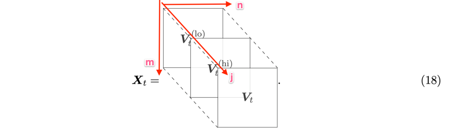

# 一个适用于金融资产组合管理问题的深度强化学习框架

作者：Zhengyao Jiang 江泽尧、Dixing Xu、Jinjun Liang

PGPortfolio: Policy Gradient Portfolio https://github.com/ZhengyaoJiang/PGPortfolio

## 摘要

金融资产组合管理是将一只基金持续分散投资到不同的金融产品的过程。本文贡献出一个无金融模型的强化学习框架，为金融资产组合提供一个深度机器学习的解决方案。本框架包括“等价独立评估拓扑学集成（EIIE）”、“资产组合向量记忆（PVM）”、“在线随机批量学习（OSBL）方案”以及“充分利用了的明确奖励函数”。本框架以三种方式进行了实现：卷积神经网络（CNN）、循环神经网络（RNN）、长短期记忆（LSTM）。对比于近期评阅的或发布了的投资组合选择策略，本文的策略在三个30分钟的加密货币回测试验上进行了检验。加密货币，相对于政府发行的货币，是电子的、去中心化的选择，其中比特币（Bitcoin）是最为熟知的例子。所有框架实现的三个实例，在所有实验上都占领了前三的位置，而且远远超出其他进行对比的交易算法。尽管回测中的佣金率（commission rate）为0.25％，但该框架能够在50天内至少获得4倍的回报。【本文发表于2017，那个时候啥行情啊？】

## 关键词

机器学习；卷积神经网络、循环神经网络、长短期记忆、强化学习、深度学习、加密货币、比特币、算法交易、投资组合管理、量化金融

## 1.简介

投资组合管理是一个决策问题，涉及到持续不断地将基金中的一部分资金分布到几种不太懂的投资品之中，期望获得最大收益的同时限制风险(Haugen, 1986; Markowitz, 1968)。传统投资组合和管理方法可以被归入四个类别：“跟随赢家”、“跟随输家”、“模式匹配”和“元学习”(Li and Hoi, 2014)。前两类基于预先构建的金融模型，而某些机器学习技术也可以辅助它们进行参数确定(Li et al., 2012; Cover, 1996)。这些方法的效果依赖于在不同市场上的模型有效性（validity）。模式匹配算法，预测的是下一个市场分布，基于一个历史数据的样本，以及基于市场分布采样数据的充分优化(Gy¨orfi et al., 2006)。最后一个类别——“元学习”方法，结合了多种其他类别的策略来达到更稳定的评估表现(Vovk and Watkins, 1998; Das and Banerjee, 2011)。

现在的金融市场交易，有利用深度机器学习的。但是，他们中的大部分是图预测价格变动或者趋势(Heaton et al., 2016; Niaki and Hoseinzade, 2013; Freitas et al., 2009)。将所有资产的历史价格作为输入，神经网络可以输出下一个时段的资产价格的预测向量。这样，交易智能体就可以基于这个预测进行操作。这个想法很容易实现，因为它是一个监督学习问题，或者更确切地说是一个回归问题。然而，这些价格预测算法的表现，高度依赖于预测的精度，但现实情况是未来的市场价格很难预测。更进一步，价格预测并不是市场操作行为，将他们转化为操作行为有需要更多的逻辑层。如果这个逻辑层是手工编码的，那么整个方法就不是一个完全的机器学习实现，因此不是非常具有扩展性和适应性。例如，一个基于预测的网络是很难将交易成本（transaction cost）考虑为一个风险因素的。

早先成功解决算法交易问题的无模型的和全机器学习方案，不去预测未来价格，而是将它视作一个强化学习问题（RL）。他们包括Moody and Saffell (2001), Dempster and Leemans (2006), Cumming (2015), 以及最近Deng et al. (2017)的强化学习应用。这些强化学习算法对于一个资产输出离散的交易信号。受限于单资产交易，他们对于通用的投资组合管理问题并不适用，毕竟在通用问题里，交易智能体管理着多种资产。

深度强化学习最近因为在电子游戏(Mnih et al., 2015) 和棋牌游戏 (Silver et al., 2016)的卓越成绩，吸引了很多注意。这些就是强化学习问题，有着分散的行为空间，而且不能直接用到行为是连续的投资组合选择问题里。尽管市场行为可以是离散化的，但离散化被视作一个主要的缺陷（drawback），因为离散的行为伴随着未知的风险。例如，一个极度离散的行为可以被定义为“投资所有的资本到一个资产里，没有到市场其余部分的投资品上分散风险”。加之，离散化导致扩展性差。市场因素，如总的投资品数，因市场的不同。为了充分利用机器学习对不同市场的适应性优势，交易算法必须是可扩展的（scalable）。一个通用目的连续深度强化学习框架，也就是actor-critic的确定策略梯度算算法，最近被引介(Silver et al., 2014; Lillicrap et al., 2016)。这些actor-critic评算法中的连续输出是通过神经网络近似的动作策略函数实现的，第二个网络被训练为奖励函数估计器。 然而，我们发现训练两个神经网络是困难的，有时甚至是不稳定的。

本文提出了一个专为资产组合管理任务而设计的强化学习框架。 该框架的核心是等价独立评估者集合（EIIE）拓扑。 IIE是一个神经网络，其作用是检查资产的历史并评估其在不久的将来的潜在增长。 每个资产的评估得分均会根据其在投资组合中资产的有意权重变化的大小进行折算，并传递给softmax层，其输出将是未来交易阶段的新投资组合权重。 投资组合的权重定义了强化学习交易智能体的市场行为。目标权重增加的资产将购买额外份额，权重减少的资产将被出售。除了市场历史，前一个交易期的投资组合权重也输入到EIIE中。这是让RL智能体考虑交易成本对其财富的影响。为此，将每个期间的投资组合权重记录在投资组合向量记忆（PVM）中。 EIIE在在线随机批量学习方案（OSBL）中进行了训练，该方案与交易前预训练，和在线交易期间的回测或在线交易都兼容。 RL框架的奖励函数是周期对数（logarithmic）收益的显式平均值。具有明确的奖励功能，EIIE在训练下沿着该功能的梯度上升方向进化。在这项工作中测试了三种不同类型的IIE，即卷积神经网络（CNN）（Fukushima,1980; Krizhevsky et al., ,2012； Sermanet et al., 2012），基本的递归神经网络（RNN）（Werbos, 1988）。 ）和长期短期记忆（LSTM）（Hochreiter and Schmidhuber, 1997）。

作为一种全机器学习的方法，该框架不限于任何特定市场。 为了检验其有效性和可盈利性，该框架在加密货币（虚拟货币，比特币为最著名的例子）交易市场 Polonix.com 中进行了测试。 一组货币是根据实验前一段时间内的交易量排名预先选择的。 在30分钟的交易时间内进行了三个时间间隔良好的回测实验。 将这三个EIIE的表现与一些最近发布或审查过的投资组合选择策略进行了比较（Li et al., 2015a; Li and Hoi, 2014）。 在所有三个实验中，EIIE均显着击败了所有其他策略。

Cryptographic currencies，或简称为加密货币，是政府发行的货币的电子的和分散式替代方案（Nakamoto, 2008; Grinberg, 2012）。虽然最著名的加密货币示例是比特币，但还有100多种其他可交易的加密货币相互竞争并与比特币竞争（Bonneau et al., 2015）。这场竞赛的动机是比特币中存在许多设计缺陷，人们正在尝试发明新的数字货币以克服这些缺陷，希望他们的发明最终取代比特币（Bentov et al., 2014; Duffield and Hagan, 2014）。 但是，越来越多的加密货币在创建时并未以打败比特币为目标，而是旨在利用其背后的区块链技术来开发去中心化应用程序[^1]。到2017年6月，所有加密货币的总市值为1020亿美元，其中41％是比特币。 [^2]因此，尽管存在设计缺陷，比特币仍然是市场上占主导地位的加密货币。结果，许多其他货币不能用法定货币购买，而只能与比特币交易。

[^1]:例如，以太坊是运行智能合约的去中心化平台，而Siacoin是用于在去中心化云Sia上买卖存储服务的货币。
[^2]:加密货币市值，http：//coinmarketcap.com/，访问：2017年6月30日。

加密货币的两种性质使它们区别于传统的金融资产，使加密货币市场成为算法投资组合管理实验的最佳测试场。这些性质是去中心化和开放，前者意味着后者。没有中心化的监管方，任何人都可以以低门槛要求参与加密货币交易。一个直接的后果就是大量的小额货币。与传统市场相比，影响这些低价市场的价格将需要较少的投资。最终，这将使交易智能体学习并利用其自身的市场行为所带来的影响。开放也意味着市场更容易进入。大多数加密货币交易所都具有用于获取市场数据和执行交易操作的应用程序编程接口，并且大多数交易所都是24/7全天候开放的，而不会限制交易频率。这些不间断市场，非常适合机器在较短的时间内在现实世界中学习。

本文的结构如下。 第2节，定义了该项目旨在解决的投资组合管理问题。 第3节，介绍了资产预选择及其背后的原因，输入价格张量以及处理市场历史中缺失数据的方法。 在第4节中，用RL的语言重新描述了项目组合管理问题。第5节，介绍了EIIE元拓扑、PVM和OSBL方案。 这三个实验的结果，在第6节中进行。

## 2.问题定义

资产组合管理是将资本不断重新分配到许多金融资产中的行为。 对于自动交易机器人，这些投资决策和操作是定期进行的。 本节提供了投资组合管理问题的数学设置。

### 2.1交易期

在这项工作中，交易算法是时间驱动（time-driven）的，其中时间被划分为等长时间段 $T$ 。在每个时间段的开始，交易智能体将资金重新分配到多种资产中去。 在本文的所有实验中，$T = 30分钟$。 资产的价格在一个时期内会涨跌，但四个重要的价格点是一个时期整体走势的特征，即开盘价、最高价、最低价和收盘价（Rogers and Satchell, 1991）。 对于连续市场，某一时期金融工具的开盘价为前一时期的收盘价。 在回测实验中，假设可以在每个时期开始时以该时期的开盘价购买或出售资产。 这种假设的理由在2.4节中给出。

### 2.2数学形式主义

投资组合包括 $m$ 个资产。 所有资产的收盘价，均包含间隔 $t$ 的$价格向量 v_t$ 。 换句话说，$v_t$ 的第 $i$ 个元素—— $v_{i,t}$，是第 $t$ 期的第 $i$ 个资产的收盘价。 同样，$v_t^{(hi)}$ 和 $v_t^{(lo)}$ 表示该时段的最高和最低价格。 投资组合中的第一种资产是特殊的，它是报价的货币，在本文的其余部分称为 $现金$ 。 由于所有资产的价格均以现金报价，因此 $v_t$ 、 $v_t^{(hi)}$ 和 $v_t^{(lo)}$ 的第一元素始终为1，即 $v_{0,t}^{(hi)} = v_{0,t}^{(lo)}  = v_{0,t} = 1，∀ t$。 在本文的实验中，现金是比特币。

对于连续市场，$v_t$的元素是 $t+1$ 时刻的开盘价和 $t$ 时刻的收盘价。 第 $t$ 个交易时刻的 $价格相对向量 y_t$ 定义为 $v_t$ 元素方式除以$v_{t-1}$：
$$
\boldsymbol{y}_{t}:=\boldsymbol{v}_{t} \oslash \boldsymbol{v}_{t-1}=\left(1, \frac{v_{1, t}}{v_{1, t-1}}, \frac{v_{2, t}}{v_{2, t-1}}, \ldots, \frac{v_{m, t}}{v_{m, t-1}}\right)^{\top}\tag{1}
$$
$y_t$ 的元素，是此时间段内，单个资产的收盘价和开盘价的商。 价格相对向量可用于计算一个时段内，投资组合总价值的变化。 如果 $p_{t-1}$ 是 $t$ 期开始时的投资组合价值，忽略交易成本，则：
$$
p_t=p_{t-1}\boldsymbol{y}_{t}\cdot \boldsymbol w_{t-1}, \tag{2}
$$
其中 $\boldsymbol w_{t-1}$ 是 $t$ 时段开始时的投资组合权重向量（从现在起称为$投资组合向量$），其第 $i$ 个元素—— $\boldsymbol w_{t-1,i}$  是资产 $i$ 在资本重新分配后在投资组合中的比例 。 元素 $\boldsymbol w_t$ 根据定义总是总和为1，$\sum_i \boldsymbol w_{t,i}=1,\forall t$。 那么时段 $t$ 的 $回报率$ 就是：
$$
\rho_{t}:=\frac{p_{t}}{p_{t-1}}-1=\boldsymbol{y}_{t} \cdot \boldsymbol{w}_{t-1}-1,\tag{3}
$$
与此同时，对应的 $对数回报率$ 就是：
$$
r_{t}:=\ln \frac{p_{t}}{p_{t-1}}=\ln \boldsymbol{y}_{t} \cdot \boldsymbol{w}_{t-1}\tag{4}
$$
在典型的投资组合管理问题中，初始投资组合权重向量 $\boldsymbol w_0$ 被选为欧几里得空间中的第一个基础向量：
$$
\boldsymbol w_0=(1,0,...,0)^\top, \tag{5}
$$
表示所有资金在进入市场之前，都在交易货币中。 如果没有交易成本，则最终投资组合价值为：
$$
p_{\mathrm{f}}=p_{0} \exp \left(\sum_{t=1}^{t_{\mathrm{f}}+1} r_{t}\right)=p_{0} \prod_{t=1}^{t_{\mathrm{f}}+1} \boldsymbol{y}_{t} \cdot \boldsymbol{w}_{t-1},\tag{6}
$$
其中 $p_0$ 是初始投资金额。 投资组合管理器的工作就是在给定的时间范围内最大化 $p_f$ 。

### 2.3交易成本

在现实世界中，在市场上买卖资产不是免费的。 费用通常来自佣金。 假设佣金率是恒定的，本节将使用递归公式来重新计算公式（6）中的最终投资组合价值，该公式扩展了 Ormos 和Urb´an (2013) 的工作。

周期 $t$ 开头的投资组合向量为 $w_{t-1}$。 由于市场价格的波动，在同一时期末，权重演变为：
$$
\boldsymbol{w}_{t}^{\prime}=\frac{\boldsymbol{y}_{t} \odot \boldsymbol{w}_{t-1}}{\boldsymbol{y}_{t} \cdot \boldsymbol{w}_{t-1}},\tag7
$$
这里 $\odot$ 是按元素乘法。 现在，在 $t$ 时段末，投资组合管理器的任务，是通过买卖相关资产重新分配投资组合向量，从 $w_t$ 到 $w_t$。 支付所有佣金后，此重新分配操作会将投资组合价值缩水了 $\mu_t$ 倍。 $\mu_t\in（0,1]$，从现在开始将被称为 $交易余数因子$。$ \mu_t $ 将在下面确定。将 $p_{t-1}$ 表示为 $t$ 周期开始时的投资组合值，然后将 $p^{\prime}$ 表示为周期末的值：
$$
p_t=\mu_t p^{\prime}_{t\cdot} \tag8
$$
回报率（3）和对数回报率（4）现在是：
$$
\rho_{t}=\frac{p_{t}}{p_{t-1}}-1=\frac{\mu_{t} p_{t}^{\prime}}{p_{t-1}}-1=\mu_{t} \boldsymbol{y}_{t} \cdot \boldsymbol{w}_{t-1}-1 \tag{9}\\
$$

$$
r_{t}=\ln \frac{p_{t}}{p_{t-1}}=\ln \left(\mu_{t} \boldsymbol{y}_{t} \cdot \boldsymbol{w}_{t-1}\right) \tag{10}\\
$$

最后方程（6）投资组合的值变成了：
$$
p_{\mathrm{f}}=p_{0} \exp \left(\sum_{t=1}^{t_{\mathrm{f}}+1} r_{t}\right)=p_{0} \prod_{t=1}^{t_{\mathrm{f}}+1} \mu_{t} \boldsymbol{y}_{t} \cdot \boldsymbol{w}_{t-1}\tag{11}
$$
与未考虑交易成本的等式（4）和（2）不同，在等式（10）和（11）中，$p^{\prime}_t\not= p_t$，两个值之间的差异是交易余数因子起作用的地方。 图1展示了投资组合向量和值之间的关系以及它们在时间轴上的动态关系。

> 
>
> 图1：交易余数因子 $\mu_t$ 的影响图。由价格相对向量 $y_t$ 表示的 $t$ 时段内的市场变动，将投资组合的价值和投资组合的权重从 $p_{t-1}$ 和 $\boldsymbol{w}_{t-1}$ 推至 $p^{\prime}_t$ 和 $\boldsymbol{w}^{\prime}_{t}$。 在时间 $t$ 的资产买卖行为，将资金重新分配到 $\boldsymbol{w}_{t}$。作为附带影响，这些交易会将投资组合缩小到 $p_t$ 达 $\mu_{t}$ 倍。 使用公式（9）中两个连续周期开始时的投资组合值，来计算周期 $t$ 的回报率。

剩下的问题是确定交易剩余因子 $ \mu_t $。 在从 $\boldsymbol{w}_{t}$ 到 $\boldsymbol{w}^{\prime}_{t}$ 的投资组合重新分配期间，如果$p_{t}^{\prime} w_{t, i}^{\prime}>p_{t} w_{t, i} $ 或 $ w_{t, i}^{\prime}>\mu_{t} w_{t, i}$，则需要出售部分或全部资产 $i$。 所有出售获得的现金总额为：
$$
\left(1-c_{\mathrm{s}}\right) p_{t}^{\prime} \sum_{i=1}^{m}\left(w_{t, i}^{\prime}-\mu_{t} w_{t, i}\right)^{+} \tag{12}
$$
其中 $0 \leqslant c_{\mathrm{s}}<1$ 是出售的佣金率，$(v)^+ = ReLu(v)$ 是按元素线性整流函数，如果 $x> 0$，则 $(x)^+ = x$，否则，$(x)^+ = 0$ 。 这笔钱和原始现金储备 $p^{\prime}_tw^{\prime}_{t,0}$ 减去新储备 $\mu_tp^{\prime}_tw_{t,0}$ 将用于购买新资产。
$$
\left(1-c_{\mathrm{p}}\right)\left[w_{t, 0}^{\prime}+\left(1-c_{\mathrm{s}}\right) \sum_{i=1}^{m}\left(w_{t, i}^{\prime}-\mu_{t} w_{t, i}\right)^{+}-\mu_{t} w_{t, 0}\right]=\sum_{i=1}^{m}\left(\mu_{t} w_{t, i}-w_{t, i}^{\prime}\right)^{+}\tag{13}
$$
其中 $0 \leqslant c_{\mathrm{p}}<1$ 是购买的佣金率，而且在两边都把 $p^{\prime}_t$ 消掉了。 利用恒等式 $(a-b)^+-(b-a)^+=a-b$ 和 $w^{\prime}_{t,0}+\sum_{i=1}^{m}w^{\prime}_{t,i}=1=w_{t,0}+\sum_{i=1}^{m}w_{t,i}$ 方程（13）被化简成：
$$
\mu_{t}=\frac{1}{1-c_{\mathrm{p}} w_{t, 0}}\left[1-c_{\mathrm{p}} w_{t, 0}^{\prime}-\left(c_{\mathrm{s}}+c_{\mathrm{p}}-c_{\mathrm{s}} c_{\mathrm{p}}\right) \sum_{i=1}^{m}\left(w_{t, i}^{\prime}-\mu_{t} w_{t, i}\right)^{+}\right]\tag{14}
$$
在线性整流器中存在 $\mu_t$ 意味着 $ \mu_t$ 在分析上无法解决，但只能迭代求解。

**定理1** 表示
$$
f(\mu):=\frac{1}{1-c_{\mathrm{p}} w_{t, 0}}\left[1-c_{\mathrm{p}} w_{t, 0}^{\prime}-\left(c_{\mathrm{s}}+c_{\mathrm{p}}-c_{\mathrm{s}} c_{\mathrm{p}}\right) \sum_{i=1}^{m}\left(w_{t, i}^{\prime}-\mu w_{t, i}\right)^{+}\right]
$$
​				$序列 \left\{\tilde{\mu}_{t}^{(k)}\right\}定义为$
$$
\left\{\tilde{\mu}_{t}^{(k)} | \tilde{\mu}_{t}^{(0)}=\mu_{\odot} \text { and } \tilde{\mu}_{t}^{(k)}=f\left(\tilde{\mu}_{t}^{(k-1)}\right), k \in \mathbb{N}_{0}\right\}\tag{15}
$$
​				$对任何 \mu_{\odot} \in[0,1] ，收敛到 \mu_{t} 就是方程 (14)的解。$

尽管Ormos和Urb´an(2013)并未对此收敛进行说明，但其证明将在附录A中给出。该定理提供了一种以任意精度近似估算交易余数因子 $ \mu_t$ 的方法。 收敛速度取决于初始猜测【错字】$\mu_{\odot}$ 的误差。  $|\mu_t-\mu_{\odot}|$ 越小，序列（15）收敛到 $ \mu_t$ 越快。 当 $c_p = c_s = c$ 时，有一种实践(Moody et al., 1998)使用 $c\sum_{i=1}^m|w^{\prime}_{t,i}-w_{t,i}|$ 近似 $\mu_t$。因此，这我的工作中，$\mu_{\odot}$ 会使用它作为序列的第一个值，即：
$$
\mu_{\odot}=c\sum_{i=1}^m|w^{\prime}_{t,i}-w_{t,i}|\tag{16}
$$
在神经网络的训练中，带有一个固定的 $k$ 的 $\tilde{\mu}_{t}^{(k)}$ 被使用到了。在回测试验中，容忍误差 $\delta$ 动态决定着 $k$ ，也就是第一个 $k$ ，以至于使用$\left|\tilde{\mu}_{t}^{(k)}-\tilde{\mu}_{t}^{(k-1)}\right|<\delta$ ，让 $\tilde{\mu}_{t}^{(k)}$ 近似于 $ \mu_t $。总的来说，$\mu_t$ 和它的近似值，是最近两个时段的投资组合向量与价格相对向量的函数：
$$
\mu_{t}=\mu_{t}\left(\boldsymbol{w}_{t-1}, \boldsymbol{w}_{t}, \boldsymbol{y}_{t}\right)\tag{17}
$$
在整个工作过程中，所有非现金资产的买卖均使用单一的固定佣金率，$c_s = c_p = 0.25％$，即 Poloniex 的最高利率。

算法智能体的目的是为了生成投资组合向量时间序列，$\left\{\boldsymbol{w}_{1}, \boldsymbol{w}_{2}, \cdots, \boldsymbol{w}_{t}, \cdots\right\}$，以便在考虑交易成本的情况下，最大化（11）中的累积资本 。

### 2.4两个假设

在这项工作中，仅考虑回测交易，在这种情况下，交易智能体假装在市场历史上的某个时间点及时返回，不知道任何“未来”市场的信息，并从那时开始进行纸面交易。 作为回测实验的要求，施加以下两个假设：

1. 零滑点：所有市场资产的流动性足够高，下订单时可以立即以最后价格进行每笔交易。

2. 零市场影响：交易智能体软件投入的资金微不足道，对市场没有影响。

在现实世界的交易环境中，如果市场中的交易量足够高，则这两个假设接近现实。

## 3.数据处理

交易实验是在交易所 Poloniex 中进行的，该交易所有约80种可交易的加密货币对，和约65种可用的加密货币[^3]。 但是，由于以下原因，交易机器人在一个时期内仅考虑一小部分货币。 除了货币选择方案之外，本节还介绍了神经网络作为输入的数据结构，规范化预处理以及处理丢失数据的方案。

[^3]:截至2017年5月23日。

### 3.1资产预选

在本文的实验中，预先选择了11种最大交易量的非现金资产作为投资组合候选。连同现金比特币一起，投资组合的大小 $m + 1$ 为 12。该数字是根据经验选择的，可以在以后的实验中进行调整。对于诸如外汇市场之类的交易量较大的市场，$m$ 可以等于可用资产总数。

选择最主要的加密货币（以下简称为货币）的原因之一是，交易量越大，意味着资产的市场流动性越好。反过来，这意味着市场状况更接近于2.4节中设定的假设1。较高的交易量也表明投资对市场的影响较小，可以建立更接近假设2的环境。考虑到与某些日常交易算法相比较高的交易频率（30分钟），在当前环境下，流动性和市场规模尤为重要。此外，加密货币市场不稳定。一些以前很少交易或流行的货币可能会在短时间内突然增加或减少交易量。因此，相对于交易期间，资产预选的数量具有更长的时间范围。在这些实验中，使用30天的时间。

但是，在回测实验中，使用最大交易量进行货币选择，会导致$幸存者偏差$。资产的交易量与其受欢迎程度相关，而受欢迎程度又取决于其历史表现。将未来的交易量排名进行回溯测试，将不可避免地和间接地将未来的价格信息传递给实验，从而导致不可靠的正面结果。由于这个原因，在回测开始之前，用于预选时就将成交量信息去掉了，以避免生存偏差。

### 3.2价格张量

历史价格数据被馈入神经网络以生成投资组合向量输出。本小节描述输入张量的结构、其归一化方案以及如何处理丢失的数据。

在周期 $t$ 的末尾，神经网络的输入是张量 $\boldsymbol{X}_{t}$，其阶数为3，形状为 $(f，n，m)$，其中 $m$ 是预选的非现金资产的数量，$n$ 是时刻 $t$ 之前的输入时段数量，$f = 3$ 是特征数量。由于历史上较早的价格与当前价格的相关性，比与最近的价格相比低得多，因此实验的 $n = 50$（一天零一个小时）。选择 $m$ 资产的标准在第3.1节中给出。时段 $t$ 上资产 $i$ 的特征是其区间中的收盘价、最高价和最低价。使用第2.2节中的符号，它们是$v_{i,t}、v_{i,t}^{(hi)}和 v_{i,t}^{(lo)}$。但是，这些绝对价格值不会直接馈送到网络。因为只有价格的变化才决定投资组合管理的表现（等式（10）），所以输入张量中的所有价格都将根据最新的收盘价进行归一化。因此，$\boldsymbol{X}_{t}$是三个归一化价格矩阵的叠加，

这里$\boldsymbol{V}_{t}、\boldsymbol{V}_{t}^{(\mathrm{hi})}$ 和 $\boldsymbol{V}_{t}^{(\mathrm{lo})}$ 就是归一化后的价格矩阵，
$$
\begin{aligned}
\boldsymbol{V}_{t} &=\left[\boldsymbol{v}_{t-n+1} \oslash \boldsymbol{v}_{t}\left|\boldsymbol{v}_{t-n+2} \oslash \boldsymbol{v}_{t}\right| \cdots\left|\boldsymbol{v}_{t-1} \oslash \boldsymbol{v}_{t}\right| \mathbf{1}\right] \\
\boldsymbol{V}_{t}^{(\mathrm{hi})} &=\left[\boldsymbol{v}_{t-n+1}^{(\mathrm{hi})} \oslash \boldsymbol{v}_{t}\left|\boldsymbol{v}_{t-n+2}^{(\mathrm{hi})} \oslash \boldsymbol{v}_{t}\right| \cdots\left|\boldsymbol{v}_{t-1}^{(\mathrm{hi})} \oslash \boldsymbol{v}_{t}\right| \boldsymbol{v}_{t}^{(\mathrm{hi})} \oslash \boldsymbol{v}_{t}\right] \\
\boldsymbol{V}_{t}^{(\mathrm{lo})} &=\left[\boldsymbol{v}_{t-n+1}^{(\mathrm{lo})} \oslash \boldsymbol{v}_{t}\left|\boldsymbol{v}_{t-n+2}^{(\mathrm{lo})} \oslash \boldsymbol{v}_{t}\right| \cdots\left|\boldsymbol{v}_{t-1}^{(\mathrm{lo})} \oslash \boldsymbol{v}_{t}\right| \boldsymbol{v}_{t}^{(\mathrm{lo})} \oslash \boldsymbol{v}_{t}\right]
\end{aligned}
$$
上面的 $\mathbf{1}=(1,1, \cdots, 1)^{\top}$ 以及 $\oslash$ 就是按元素初操作子。

在时段 $t$ 的末尾，根据某些策略 $\pi$，投资组合管理器仅使用来自价格张量 $\boldsymbol{X}_{t}$ 和先前投资组合矢量 $\boldsymbol{w}_{t-1}$ 的信息得出投资组合矢量 $\boldsymbol{w}_{t} $。 换句话说，$\boldsymbol{w}_{t}=\pi\left(\boldsymbol{X}_{t}, \boldsymbol{w}_{t-1}\right)$。 在时段 $t +1$ 的末尾，可以使用公式（10）使用价格变化矢量 $y_{t + 1}$ 的附加信息，基于决策 $\boldsymbol{w}_{t}$ 计算该时段的对数收益率，其中 $r_{t+1}=\ln \left(\mu_{t+1} \boldsymbol{y}_{t+1} \cdot \boldsymbol{w}_{t}\right)$ 。 用RL的语言来说，$r_{t+1}$是投资组合管理智能体在环境条件 $\boldsymbol{X}_{t}$ 下的行动 $\boldsymbol{w}_{t} $的直接奖励。

### 3.3填充缺失数据

某些选定的货币缺少部分历史记录。缺少数据，是由于这些货币是相对较新出现的。货币存在之前的数据点，在交易所中标记为非数字（NANs）。 NANs 仅出现在训练集中，因为硬币选择标准是回测前30天的数量排名，这意味着所有资产必须在此之前存在。

由于神经网络的输入必须是实数，因此必须替换这些NAN。在作者先前的工作(Jiang and Liang, 2017)中，缺失数据填充了伪造的递减价格序列，衰减率为0.01，以使神经网络避免在训练过程中选择持有这些缺失的资产。但是，事实证明，这些网络深深地记住了这些特殊资产，即使在反向测试实验中它们处于非常有希望的上升趋势时，它们也避免持有它们。因此，在当前的工作中，使用“虚假价格变动（衰减率为0）”来填充缺失的数据点。此外，在新的EIIE结构下，新的网络将无法显示单个资产的身份，从而使他们无法根据长期以来特定资产的不良记录做出决策。

## 4.强化学习

考虑到第2节中定义的问题，本节介绍了使用确定策略梯度算法的强化学习（RL）解决方案框架。在该框架下还给出了显式的奖励函数。

### 4.1环境与智能体

在算法投资组合管理问题中，智能体是在金融市场环境中执行交易操作的软件投资组合管理器。这种环境包括市场中所有可用资产以及所有市场参与者对它们的期望。

智能体不可能获得如此大而复杂的环境的全部状态信息。但是，在技术交易者的哲学中(Charles et al., 2006; Lo et al., 2000)，所有相关信息都被认为已经反映在资产价格中了，而资产价格向智能体公开。按照这种观点，环境状态可以用整个市场历史直到状态发生时的所有订单的价格来大致表示。尽管对于许多金融市场来说，完整的订单历史记录都是开放在公共领域，但是对于软件智能体而言，要实际处理此信息实在是一项艰巨的任务。结果，订单历史信息的子采样方案被用于将来简化市场环境的状态表示。这些方案包括第3.1节中所述的资产预选、周期性特征提取和历史记录截断。定期特征提取将时间离散化为多个时段，然后提取每个时段中的最高价，最低价和收盘价。历史记录截断仅采用最近一段时间的价格特征来表示环境的当前状态。结果表示为第3.2节中描述的价格张量 $\boldsymbol{X}_{t}$ 。

根据第2.4节中的假设2，智能体的交易行为不会影响市场的未来价格状态。但是，在 $t$ 时刻开始时采取的动作将影响 $t +1$ 时刻的奖励，结果将影响其采取的动作。为了在资产 $t + 1$ 期间重新分配财富，智能体在 $t + 1$ 期初进行的买卖交易由投资组合权重 $\boldsymbol{w}^{ \prime }_{t}$ 和 $\boldsymbol{w}_{t}$ 之间的差异决定。  $\boldsymbol{w}^{ \prime }_{t}$ 在方程（7）中用 $\boldsymbol{w}_{t-1}$ 定义，它在最后一个周期的作用中也起作用。由于在最后一个周期中已经确定了 $\boldsymbol{w}_{t-1}$ ，因此智能体在时间 $t$ 的动作，只能由投资组合向量$\boldsymbol{w}_{t}$ 表示，
$$
\boldsymbol{a}_{t}=\boldsymbol{w}_{t\cdot}\tag{19}
$$
因此，通过 $r_{t + 1}$ 和 $\mu_{t + 1}$ 对 $\boldsymbol{w}_{t}$ 的依赖性（17），先前的动作确实对当前动作的决定有影响。 在当前框架中，通过将 $\boldsymbol{w}_{t-1}$ 视为环境的一部分并将其输入到智能体的行为制定策略中，来封装这种影响，因此 $t$ 处的状态表示为 $\boldsymbol{X}_{t}$ 和 $\boldsymbol{w}_{t-1}$ 对，
$$
\boldsymbol{s}_{t} = (\boldsymbol{X}_{t},\boldsymbol{w}_{t-1}),\tag{20}
$$
其中 $\boldsymbol{w}_{0}$ 在（5）中是预先确定的。 状态 $\boldsymbol{s}_{t}$ 由两部分组成，由价格张量 $\boldsymbol{X}_{t}$ 表示的外部状态，以及从上一周期 $\boldsymbol{w}_{t-1}$ 开始的由投资组合矢量表示的内部状态。 因为根据第2.4节的假设2，投资组合金额与市场的总交易量相比可以忽略不计，所以内部状态中不包含 $p_t$。

### 4.2充分的利用和奖励功能

在 $t_f + 1$ 周期结束时，智能体的工作就是使等式（11）的最终投资组合价值 $p_f $ 最大化。 由于智能体无法控制初始投资 $p_0$ 的选择以及整个投资组合管理过程 $t_f$ 的时间，因此该工作等同于最大化平均对数累积回报 $R$，
$$
\begin{aligned}
R\left(\boldsymbol{s}_{1}, \boldsymbol{a}_{1}, \cdots, \boldsymbol{s}_{t_{\mathrm{f}}}, \boldsymbol{a}_{t_{\mathrm{f}}}, \boldsymbol{s}_{t_{\mathrm{f}}+1}\right) &:=\frac{1}{t_{\mathrm{f}}} \ln \frac{p_{\mathrm{f}}}{p_{0}}=\frac{1}{t_{\mathrm{f}}} \sum_{t=1}^{t_{\mathrm{f}}+1} \ln \left(\mu_{t} \boldsymbol{y}_{t} \cdot \boldsymbol{w}_{t-1}\right) \\

&=\frac{1}{t_{\mathrm{f}}} \sum_{t=1}^{t_{\mathrm{f}}+1} r_{t}
\end{aligned} \tag{21,22}
$$

在（21）的右侧， $\boldsymbol{w}_{t-1}$ 由作用at-1给出，yt是来自状态变量st的价格张量X t的一部分，μt是wt-1，wt和yt的函数，如（17）中所述。用RL语言表示，R是累积奖励，而r t / t f是单个情节的直接奖励。分母t f与使用累积投资组合价值的奖励函数不同（Moody等，1998），它保证了不同长度的运行之间奖励函数的公平性，使其能够在小批量中训练交易策略。

通过这种奖励功能，当前框架与许多其他RL问题有两个重要区别。一是情节性奖励和累积性奖励都可以准确表达。换句话说，环境的领域知识是精通的，并且可以被代理充分利用。这种确切的表达方式基于第2.4节的假设1，即动作对未来状态的外部部分（价格张量）没有影响。行动与外部环境的这种隔离也使人们可以使用同一市场历史部分来评估行动的不同顺序。框架的此功能被认为是一个主要优势，因为在交易游戏中进行全新的试验既费时又费力。

第二个区别是，所有情节奖励对于最终回报都是同等重要的。这种区别与零市场影响假设一起，可以将r t / t f视为贴现因子为0的行为w t的行为价值函数，而无需考虑该行为的未来影响。拥有明确的行动价值函数进一步证明了充分利用方法的合理性，因为探索其他RL问题主要是为了尝试各种行动价值函数类别。

另一方面，如果不进行探索，则可以通过随机初始化策略参数来避免局部最优，这将在下面进行讨论。

4.3确定性策略梯度

策略是从状态空间到动作空间π的映射：S→A。在当前框架中进行充分利用后，策略将确定性地从状态中产生动作。最佳策略是使用梯度上升算法获得的。为了实现这一点，通过一组参数θ和一个t =πθ（s t）来指定一个策略。将时间间隔[0，t f]的πθ的性能指标定义为时间间隔的相应奖励函数（21），