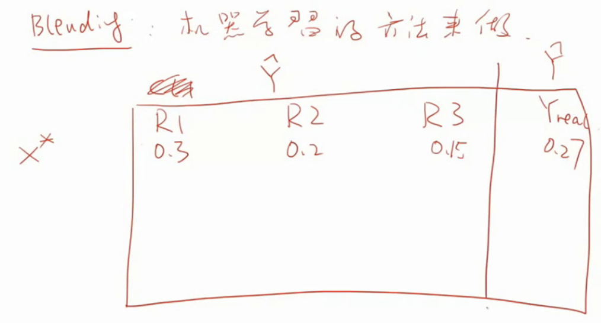
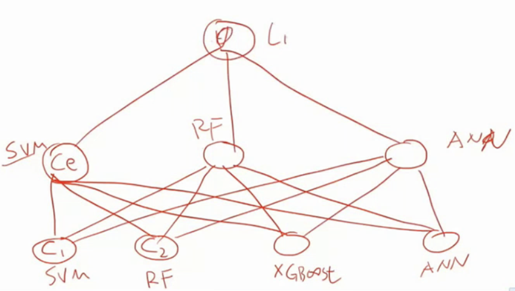
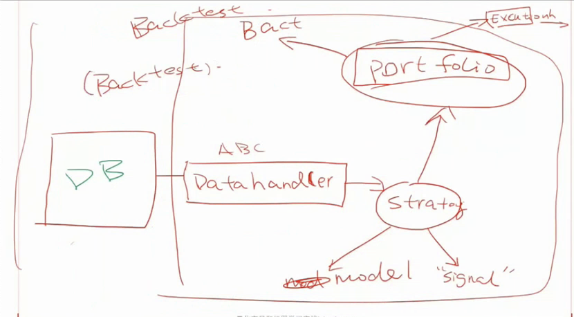
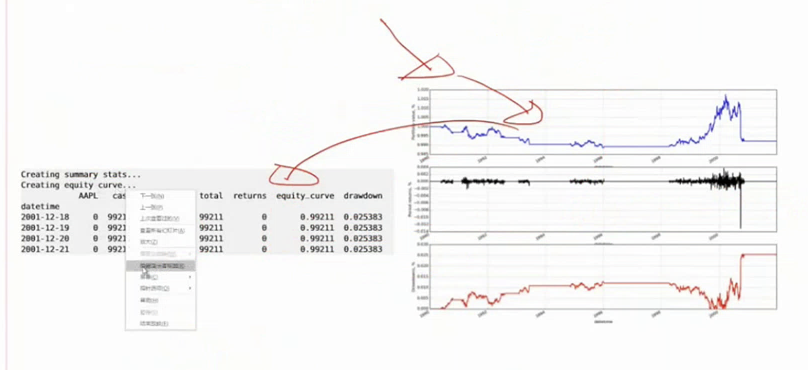

# 第七课 模型评估与风险控制（根本没讲风控）

看上次作业吧，一定要动手做。

regius.dao.dfmgr 

## 1.数据分析

例如：注意好好处理类别不平衡问题。提前心里有个预设，然后画个图去看看存在的问题

## 2.分析问题

定位清楚问题，效果不好是哪里的问题？模型不行还是参数不好？初始参数设定不要想当然 

提取feature包括：

- 长线特征

- 短线特征
- 自定义特征（保密性高如nlp特征） 

### 本堂课主要内容

集成学习 是一种救命神器 前两步是特征选择与建模，第三步就是集成，下一步是策略

### 两个简单且重要的方法

- voting(hard不带权) 
- stacking/blinding(带权voting) 

权重如何定义？1.谁的准谁大。2.用机器学习方法赋权，新建立一层监督学习（可以是SVM、Linear、神经网络回归 ）【49min】。               甚至可以垒很多层，多个集成后再集成【效果不一定，有可能过拟合】                注意不应该在train set上做blinding！而应该在valid set？？？ 

### adboost

理论上证明弱分类器可以变成强分类器。

核心假设1：样本的加权，错误的要惩罚加大，新生产一个模型。不断地重复此步骤。

核心方法2：将模型再加权集成。 

100个样本，80个对，20个错。是的对的和错的分别占权重的0.5。所以对的样本是1/160，错的是1/40。 

公式推理要看一下。

优点：永远不会过拟合！！！？？？

缺点：串行模型如何把R方提升到0.06以上？ 

对未来对预测（模型管，数据科学管）跟你基于这个预测使得你的利润最大化，是完全两件事情

# 第八课 搭建自动交易系统

有一个新模型叫ExtraTreesRegress

## NLP 

## Strategy

定义策略的performance，在非RL下，你需要人工定义。

PnL、Loss/Win、Average P PnL。P是信心？

Risk即方差

Sharp Ratio是评价每份风险下的收益率。查一下公式

凯利公式，可以确定仓位。查一下公式。

## 基于事件驱动的量化引擎

```python
while(True):
  new_event = get_event()
  if new_event == :
    do_something()
  heartbeat(500ms)   
```

       请研究清楚第八天的代码，最终跑出类似优矿的图来。               第九课看论文：尽信书不如无书。论文是最不完善的东西。要找其优劣点。特征值，SVD也就是PCA降维（对任何矩阵都可以做 ）——与持仓比例有关系对称矩阵的特性，谱定理课程推荐：MIT线性代数公开课 如何求解投资组合权重？风险risk=wT sigema w

# 第九课

看论文：尽信书不如无书。论文是最不完善的东西。要找其优劣点。特征值，SVD也就是PCA降维（对任何矩阵都可以做 ）——与持仓比例有关系对称矩阵的特性，谱定理课程推荐：MIT线性代数公开课 如何求解投资组合权重？风险risk=wT sigema w

本节课在最小化风险的情况下，求助投资组合各资产的权重

## 关于风险和投资组合的关系

#### 方法1：求历史收益率矩阵的SVD特征值

$$
risk = \vec w^{T} \Sigma \vec w
$$

$\Sigma$是协方差矩阵，risk对应的，就是最小值特征值，

Max E.V. Eigenportfolio是市场组合。2nd E.V Eigenportfolio才是你要买的组合。【别人也知道啊】计算出来的负值，不持仓。【相当于做空？】


#### 方法2：凸优化问题求解上面的带有约束下的最小risk

$$
min_{w}(risk) = min_{w}w^T\Sigma w \\
s.t. w_1+w_2+...+w_n=1\\
解：\\
\vec w^{*}=\frac{\Sigma^{-1}I}{(\Sigma^{-1}I)^TI}
$$


推荐课：斯坦福convex optimization凸优化课

总结：方法1，在美股上要比方法1好一点。


#### 方法3：Filtered Minimum Variance Portfolio

Random Matrix Theory

要拿掉历史收益的协方差矩阵的随机因素抽走。随即矩阵里的每一个元素都来自一个高斯分布（Marchenko-Pastur分布）采样出的。 没听懂1h30min

使用那个分布将某些特征值设为0，再进行矩阵恢复。1h40min。然后在按照方法1求出一个$\vec w^{'}$。


上图横坐标是时间，纵坐标是收益率


#### 论文讲解

第一篇：1603.08604v1《Classification-based Financial Markets Prediction using Deep Neural Networks》高频5分钟，9895个特征，KNL。明显是做金融的人写的。不会用GPU

第二篇：150612a。特征做的太烂了。明显是做机器学习的人做的。

第三篇：ecbsp9.en欧盟中央银行出的quant报告。本讲的是，网络大数据（Google和Twitter）搜索熊市牛市的关键词，判断股价。结论，Twitter更准。

第四篇：fora_gyula_krisztian。搞了一些feature。


# 第十课

过电影：爬数据、数据清洗、机器学习/技术指标/camp model、总框架【要么分类要么回归、特征提取、模型选择、回测、风控】

没讲：期权（option，要学好凸优化理论）、强化学习。

第五篇：20130506050541242.pdf。SVM+粒子滤波【基于遗传算法的滤波，尤其对时间序列有用，优于卡尔曼滤波器】多看看它实现的feature。当然公开的，都比较中规中矩。 

第六篇：multi-svm。【得到老师高度评价】项目：https://github.com/ezhulenev/orderbook-dynamics 仔细看。没有藏着掖着。http://eugenezhulenev.com/blog/2014/11/14/stock-price-prediction-with-big-data-and-machine-learning/


可以时不时去优矿、聚宽、

在大脑里，建立大的知识索引库。知道去哪里找。@爱可可爱生活，了解某篇论文提出了什么问题，如何解决的不强求你立刻看懂。十分钟就够了。【从哪里寻求帮助，比自己解决问题的能力更重要。】

课程推荐：

https://quantsoftware.gatech.edu/Machine_Learning_for_Trading_Course

维护主简历，半个月去实时更新一次。


技术型面试，不要瞎吹，因为铁定人家会follow up问你的，也就是追问！

非常common的问题：如何处理过拟合？如何看待正则化？

建立个人品牌，终身的事，花大力气搭理，类似于穿衣洗脸一样：github、微博、网站。


\##量化交易与风险管理（具体课程信息可以点击链接查看）：

STATS 244 [Quantitative Trading: Algorithms, Data and Optimization 152](http://scpd.stanford.edu/search/publicCourseSearchDetails.do?method=load&courseId=66755871)
STATS 243 [Financial Models and Statistical Methods in Active Risk Management 56](http://scpd.stanford.edu/search/publicCourseSearchDetails.do?method=load&courseId=1210773)
这两个课基本上代表了学界对量化研究的前沿水平吧，作为学术水平稳稳第一的Stanford统计系开的课，质量还是有保证。

STATS 244的老师是黎子良教授，在quantitative finance研究颇深，上课旁征博引算是给我打开了一个新世界，增添了很多量化策略方面的灵感。这个课讲的东西很全，比如

Algorithmic trading, informatics and optimal execution（程序化交易，信息学与最优执行）
Data analytics and models of transactions data（数据分析，交易数据的建模）
Limit order book dynamics in electronic exchanges（电子交易所的限价指令薄的动态特性）
Market making and inventory control（做市与仓位控制）
Risk management and regulatory issues（风险管理与合规）
Statistical trading rules and performances evaluation（统计交易法则与表现评估）。
STATS 243的老师是他之前的博士生，数学系出身重视证明，也是内容挺多：

Back testing, stress testing, and Monte Carlo methods
Censored data, survival analysis and hazard functions
Correlated default intensities
Frailty and contagion
Risk surveillance
Early warning and adaptive risk control methodologies

\#报名方式与细节

请与本人联系